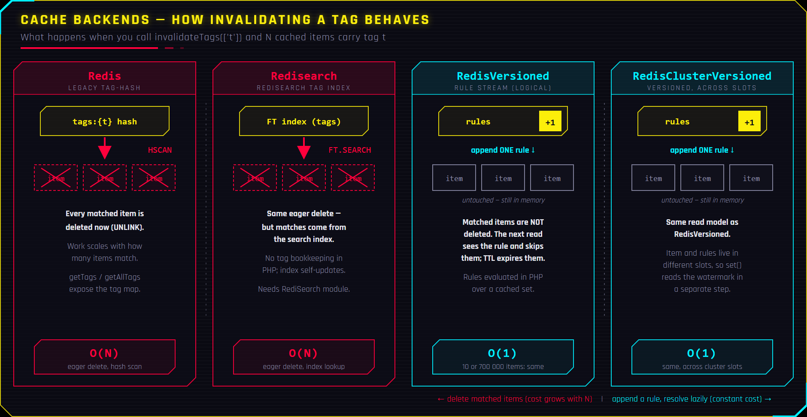
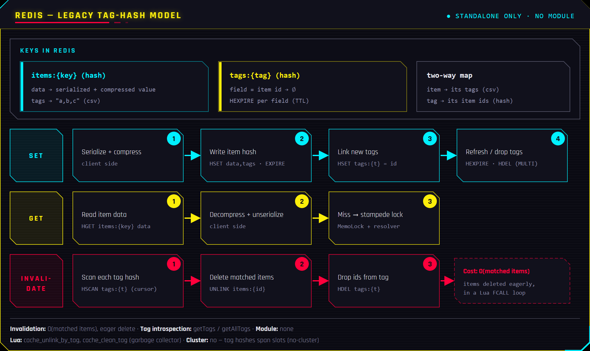
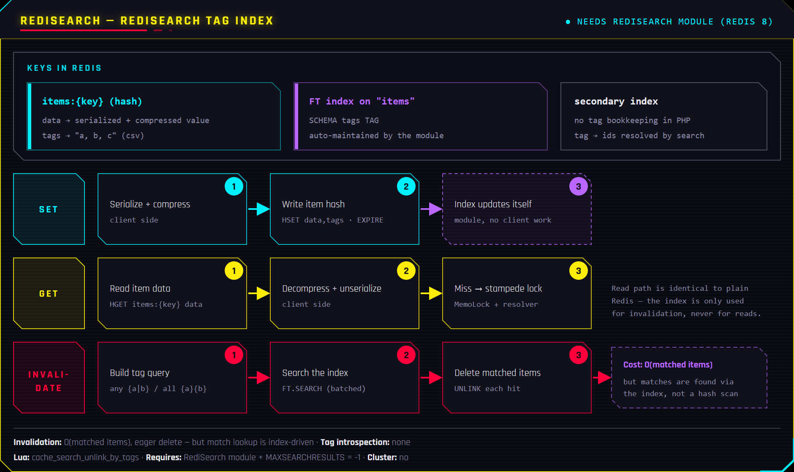
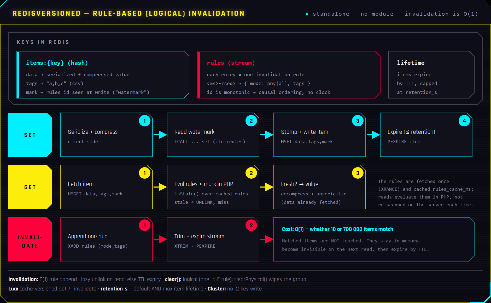
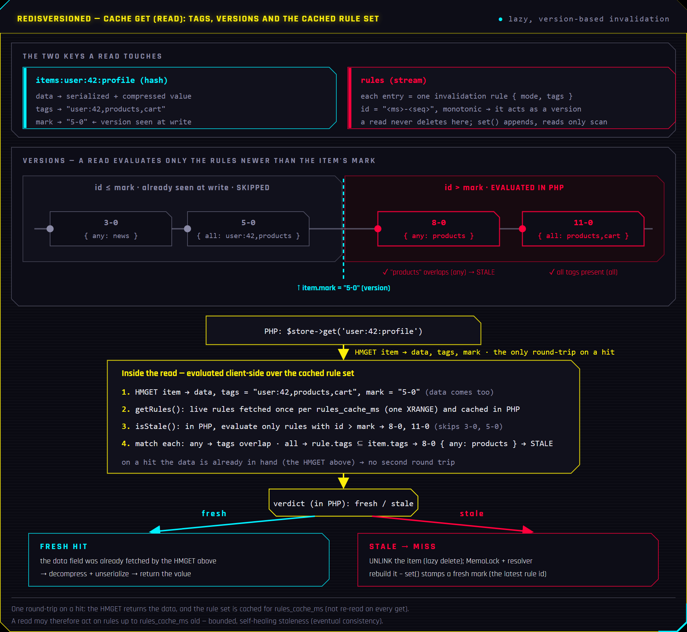
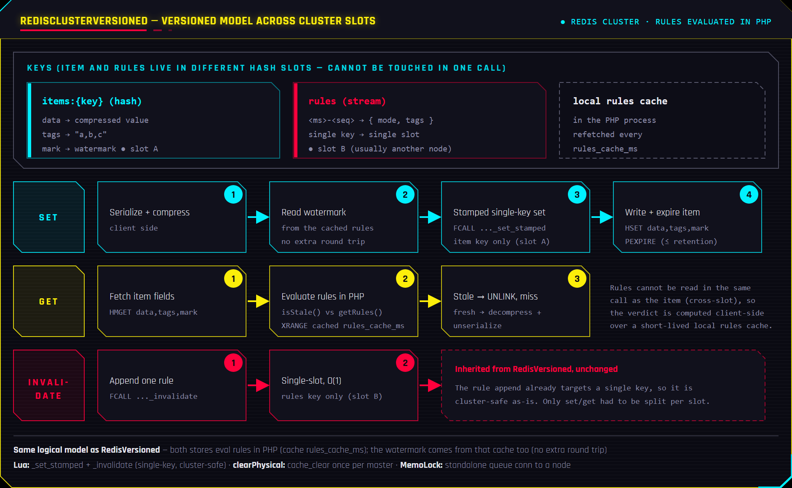

# Cache Stores (APCu, Redis, Redisearch, RedisVersioned, RedisClusterVersioned)

This library provides a two-tier cache system designed to minimize database load
and speed up response times. **Every store query that returns the same data for
the same input should be cached.** Database queries are expensive - cache is not.

See also: [README.MEMOLOCK.md](README.MEMOLOCK.md) for stampede protection.

## Why cache matters

A typical page load may trigger 10-30 database queries. Many of these return
the same data on every request (e.g., job categories, competences, navigation
menus). Caching these results means:

- **Faster responses** - APCu reads take microseconds, Redis reads take ~1ms
- **Lower database load** - fewer queries = more capacity for writes and complex operations
- **Better scalability** - cache handles traffic spikes that would overwhelm the database

**Rule of thumb:** If data doesn't change on every request, cache it.

## The two tiers

| Tier | Backend | Shared? | Speed | Survives restart? | Tags? |
|------|---------|---------|-------|-------------------|-------|
| **Perishable** | APCu | No (per-worker) | Fastest (~1μs) | No | No |
| **Persistent** | Redis / Redisearch / RedisVersioned / RedisClusterVersioned | Yes (all workers/servers) | Fast (~1ms) | Yes | Yes |

**Use perishable (APCu)** for data that is read frequently and changes rarely
within a single request cycle - like lookup tables, categories, and reference data.

**Use persistent (Redis)** for data that must be shared across workers or servers,
or when you need tag-based invalidation.

## Accessing the cache

Access stores via the cache service so they are created with the correct config
and connections:

```php
use Ovos\Service\Cache;

$cacheService = $this->container->get(Cache::SYMBOL);

// Get specific tier
$perishable = $cacheService->getPerishable()->getStore();  // APCu
$persistent = $cacheService->getPersistent()->getStore();   // Redis/Redisearch

// Shorthand (persistent by default)
$store = $cacheService->getStore();                         // Redis/Redisearch
$store = $cacheService->getStore(persistent: false);        // APCu
```

## Store differences

The four persistent stores split into two families by **what `invalidateTags()`
actually does**. The tag-hash (`Redis`) and RediSearch (`Redisearch`) stores
**delete the matched items eagerly**, so the work grows with the number of
matches. The versioned stores (`RedisVersioned`, `RedisClusterVersioned`) **append a
single invalidation rule** and let reads resolve staleness lazily, so the cost
is constant no matter how many items match.



### APCu (`Ovos\Cache\Store\Apcu`)
- In-process memory cache (per PHP worker).
- Fastest option, but not shared across servers or processes.
- No tags support.
- Best for: lookup tables, reference data, anything read-heavy that changes rarely.

### Redis (`Ovos\Cache\Store\Redis`)
- Distributed cache shared across workers/servers.
- Supports tags with `getTags()`, `invalidateTags()`, and `getAllTags()`.
- Uses Redis Pub/Sub for MemoLock queueing (needs a separate queue connection).
- Best for: shared state, session-adjacent data, anything needing tag invalidation.



### Redisearch (`Ovos\Cache\Store\Redisearch`)
- Distributed cache with tag invalidation powered by RediSearch.
- Uses a RediSearch TAG index for fast tag-based invalidation.
- Requires the RediSearch module (bundled in Redis 8) and `MAXSEARCHRESULTS`
  set to `-1`.
- Supports tags in `set()` and `invalidateTags()`, but does not expose
  `getTags()` or `getAllTags()`.
- Best for: projects with many tagged cache entries where invalidation speed matters.



### RedisVersioned (`Ovos\Cache\Store\RedisVersioned`)
- Distributed cache with **rule based (logical) tag invalidation**:
  `invalidateTags()` appends one rule to a stream instead of deleting the
  matched items - **O(1) whether 10 or 700000 items match**. Reads fetch the
  item in one `HMGET` and evaluate the rules in PHP over a short-lived local
  rule cache (`rules_cache_ms`); stale items are lazily unlinked and
  physically expire by their TTL.
- `clear()` is logical as well (one rule matching everything);
  `clearPhysical()` wipes the whole group for maintenance.
- `rules_retention_s` (default 30 days) is the default **and maximum** item
  lifetime: a ttl of 0 means "as long as the store allows", a ttl above the
  retention is capped to it (and logged).
- The rules stream carries no TTL, so a `volatile-*` (or `noeviction`)
  eviction policy never evicts it - run one of those. Should it be lost anyway
  (`allkeys-*`, a `DEL`, a slot gone with a cluster node), the read path fails
  safe: an item stamped with a rule the stream no longer remembers is a miss,
  never a stale hit, at the price of recomputing the group once.
- Does not expose `getTags()` or `getAllTags()`; no RediSearch module needed.
- Best for: projects with very large tag invalidations, where deleting the
  matched items at invalidation time is too expensive.



A closer look at the read path - how a `get()` fetches the item in one
`HMGET` and uses its `mark` (the version it was stamped with) to evaluate,
in PHP over a short-lived local rule cache (`rules_cache_ms`), only the
invalidation rules it has not seen yet (id > mark), matches them against the
item's tags, and serves a fresh hit or lazily unlinks a stale item:



### RedisClusterVersioned (`Ovos\Cache\Store\RedisClusterVersioned`)
- The RedisVersioned store on a **Redis Cluster**: same data model and
  semantics; reads evaluate the invalidation rules on the PHP side behind a
  short-lived local cache (`rules_cache_ms`).
- Requires a `redis_cluster` connection (a `seeds` list) plus a standalone
  queue connection **pointed at a node of the same cluster** for MemoLock
  pub/sub (see the configuration reference below).
- No RediSearch module required on the cluster nodes.



### Cost at a glance

Theoretical per-operation cost, where **N** = items carrying the invalidated
tag, **T** = tags on the item being written, and **R** = invalidation rules
newer than a read's item that still have to be evaluated:

| Backend | `get()` hit | `set()` | `invalidateTags()` | `clear()` |
|---------|-------------|---------|--------------------|-----------|
| **APCu** | O(1) | O(1) | &mdash; *(no tags)* | O(n) |
| **Redis** (tag-hash) | O(1) | O(T) | **O(N)** | O(n) |
| **Redisearch** | O(1) | O(1) ‡ | **O(N)** ‡ | O(n) |
| **RedisVersioned** | O(1 + R) | O(1) | **O(1)** | **O(1)** |
| **RedisClusterVersioned** | O(1 + R) | O(1) | **O(1)** | **O(1)** † |

‡ RediSearch maintains the tag index itself: `set()` is a single write (no
per-tag bookkeeping like the tag-hash store's O(T)), and `invalidateTags()`
finds the N matches through the index instead of scanning a tag hash &mdash; the
same O(N) eager delete, with a smaller constant.
† `clear()` is O(1) logically (one rule); `clearPhysical()` is O(number of masters).

- **Invalidation is the real fork.** Redis and Redisearch delete every matched
  item when you invalidate, so the call is O(N) &mdash; instant for a handful of
  items, a latency spike when a tag fans out to thousands. The versioned stores
  append one rule and return in O(1) no matter how many items match; staleness is
  resolved later, lazily, on read.
- **Versioned reads stay ~O(1).** R counts only the rules written *after* the
  item was last stamped; rules age out by `rules_retention_s`, and a rebuilt item
  is re-stamped to the newest version, so R falls back toward 0. Reads do not
  degrade as invalidations pile up.
- **Round trips, not big-O, set the floor.** Each persistent op above is one
  server round trip (Lua / pipeline); the versioned read refreshes its rule set
  at most once per `rules_cache_ms`, shared across every read in that window. A
  round trip is ~0.1-1 ms on a LAN; an in-process APCu hit is ~1 µs &mdash; big-O
  only starts to bite once N or R is large.

Bottom line: reads are O(1)-ish on every backend, so the choice comes down to
**invalidation** &mdash; pick a versioned store when tags match many items or you
invalidate often; the tag-hash / RediSearch stores are fine when invalidations
are rare and always small, or when you need `getTags()`/`getAllTags()` (only the
tag-hash `Redis` store exposes them).

### Measured

One local run of `php cli.php benchmarks run` (loopback Redis, single machine).
Absolute seconds depend on the benchmark's iteration constants, so read them as
**cross-store ratios**, not wall-clock truth; on loopback the round trips are
near-free, so these mostly expose CPU/algorithmic cost. Time in seconds, lower
is faster:

| Backend | `readHits` | `readHits` + large backlog | `invalidateMatchingAll` | `invalidateRepeated` | `writeOverwrite` | `churn` |
|---------|-----------|----------------------------|--------------------------|----------------------|------------------|---------|
| **Redis** (tag-hash) | 3.06 | 4.10 | 0.0254 | 0.94 | 6.08 | 3.66 |
| **Redisearch** | 3.24 | 3.88 | 0.0397 | 0.73 | 3.24 | 2.76 |
| **RedisVersioned** | 3.19 | 4.72 | **0.0005** | **0.38** | 3.62 | 2.98 |
| **RedisClusterVersioned** | 4.66 | 6.80 | **0.0006** | 0.53 | 4.96 | 4.16 |

What the run confirms:

- **O(1) vs O(N) invalidation is the headline.** A versioned `invalidateTags()`
  lands in ~0.5 ms versus ~25 ms (Redis) and ~40 ms (Redisearch) &mdash; about
  **50× and 80× faster**, and the gap widens with the match count.
- **`set()`'s O(T) shows up.** The tag-hash store's `writeOverwrite` (6.08 s) is
  ~1.7-1.9× the single-write stores (3.2-3.6 s): that is the per-tag
  `HSET`/`HEXPIRE` bookkeeping. Redisearch and the versioned stores write once and
  pay nothing per tag.
- **Reads stay ~O(1) until R grows.** Steady `readHits` are within ~6 % across
  Redis, Redisearch and RedisVersioned (3.1-3.2 s). After a large invalidation
  backlog the versioned read climbs to 4.72 s (~20 % over Redisearch) as more
  unseen rules are evaluated and held client-side &mdash; it shows up in the
  memory column (~460 KB of cached rules), not as a cliff.
- **`churn` (wide fan-out, sparse re-reads) separates them.** When each round
  invalidates a wide slice but only a hot subset is re-read, the tag-hash Redis is
  slowest (3.66 s) &mdash; it eagerly deletes the whole slice every round and pays
  O(T) per rebuild &mdash; while Redisearch (2.76 s) and RedisVersioned (2.98 s)
  stay close. The versioned store beats the legacy tag-hash by ~20 %; Redisearch
  edges it here because its reads are flat (no rule eval) and an indexed delete is
  still cheap at this fan-out. Widen the fan-out further, or count the
  invalidation-call latency rather than throughput, and the versioned O(1) pulls
  ahead.
- **Cluster overhead is the client, not the algorithm.** RedisClusterVersioned
  trails the standalone versioned by ~1.4-1.6× across the board (`churn` 4.16 vs
  2.98 s), matching the raw cluster-client cost (`Connection\RedisCluster`: 1.41 s
  cluster vs 0.92 s standalone). Invalidation is still O(1) (~0.6 ms) on the
  cluster.

(APCu is a different tier &mdash; in-process, no tags &mdash; so it is not part
of this persistent-store run.)

Selecting the store is done in config:

```yaml
cache:
  persistent:
    store: Redisearch   # Redis, Redisearch, RedisVersioned or RedisClusterVersioned
```

## Real-world usage patterns

### Pattern 1: Cache in a Store with CacheService trait (recommended)

The most common pattern. Use the `CacheService` trait in your store to get
cache access and built-in invalidation:

```php
<?php
declare(strict_types=1);

namespace Stores;

use Models\Competence;
use Ovos\Store\Mysql;
use Ovos\Store\Mysql\Traits\Find;
use Ovos\Store\Mysql\Traits\CacheService;

class Competences extends Mysql
{
    use Find;
    use CacheService;

    public const ?string TABLE = 'competences';
    public const ?string MODEL = Competence::class;

    public function __construct()
    {
        parent::__construct();
        $this->initCacheService();  // Initialize cache in constructor
    }

    /**
     * @return Competence[]
     */
    public function getActive(): array
    {
        // 1. Try cache first (perishable = APCu, fastest)
        $store = $this->cacheService->getPerishable()->getStore();
        $cacheId = self::TABLE;

        if($items = $store->get($cacheId))
        {
            return $items;
        }

        // 2. Cache miss - query database
        $query = $this->query()
            ->select('id, id, name')
            ->where('active = 1')
            ->orderBy('name');
        $statement = $this->prepareQuery($query);
        $statement->execute();

        $items = $this->fetchGrouped($statement, Competence::class);

        // 3. Export to read-only format (smaller serialization, faster reads)
        foreach($items as &$item)
        {
            $item = $item->export();
        }
        unset($item);

        // 4. Store in cache
        $store->set($cacheId, $items);

        return $items;
    }
}
```

### Pattern 2: Multiple cache keys per store

When a store serves different data shapes, use separate cache keys:

```php
class Jobs extends Mysql
{
    use Find;
    use CacheService;

    public const ?string TABLE = 'jobs';

    // Define cache key constants for different data sets
    public const string CACHE_RELATIONS = 'relations';
    public const string CACHE_NAMES = 'names';

    public function __construct()
    {
        parent::__construct();
        $this->initCacheService();
    }

    public function getRelations(): array
    {
        $store = $this->cacheService->getPerishable()->getStore();
        $cacheId = self::TABLE . '_' . self::CACHE_RELATIONS;

        if($items = $store->get($cacheId))
        {
            return $items;
        }

        // ... expensive query with JOINs ...

        $store->set($cacheId, $items);
        return $items;
    }

    public function getNames(): array
    {
        $store = $this->cacheService->getPerishable()->getStore();
        $cacheId = self::TABLE . '_' . self::CACHE_NAMES;

        if($items = $store->get($cacheId))
        {
            return $items;
        }

        // ... lightweight query ...

        $store->set($cacheId, $items);
        return $items;
    }
}
```

### Pattern 3: Cache with a resolver (simplest API)

The resolver pattern combines get + compute + set into a single call.
If the key exists, the cached value is returned. If not, the resolver runs
and the result is cached automatically.

```php
$store = $cacheService->getStore();

$value = $store->get(
    'user:42:profile',
    resolver: fn() => $this->fetchProfileFromDB(42),
    ttl: 300,
);
```

With tags for targeted invalidation:

```php
$value = $store->get(
    'user:42:profile',
    resolver: fn() => $this->fetchProfileFromDB(42),
    ttl: 300,
    tags: ['user', 'user:42'],
);

// Later, when user 42 updates their profile:
$store->invalidateTags(['user:42']);
```

The resolver can also modify tags and TTL dynamically:

```php
$value = $store->get(
    'key',
    resolver: function($store, $key, &$ttl, &$tags)
    {
        $data = $this->computeExpensiveResult();
        $tags[] = 'computed:' . $data->category;
        $ttl = $data->isVolatile ? 60 : 3600;
        return $data;
    },
    ttl: 300,
    tags: ['base-tag'],
);
```

### Pattern 4: Traditional get/set

If you prefer explicit control:

```php
$store = $cacheService->getStore();

if($store->get('key') === null)
{
    $value = $this->expensiveComputation();
    $store->set('key', $value, ttl: 30);
}
```

## Cache invalidation

### Via the CacheService trait

The trait provides `invalidateCache()` which deletes by the store's TABLE constant:

```php
// In a controller after saving data:
$store = new CompetencesStore;
$store->invalidateCache();                         // Deletes cache key "competences"
$store->invalidateCache(Jobs::CACHE_RELATIONS);    // Deletes cache key "jobs_relations"
$store->invalidateCache(Jobs::CACHE_NAMES);        // Deletes cache key "jobs_names"
```

### Via tags (persistent stores only)

Tags let you invalidate groups of related cache entries at once:

```php
$store->invalidateTags(['user:42']);     // Invalidate everything tagged with user:42
$store->invalidateTags(['products']);    // Invalidate all product-related caches
```

By default items matching **any** of the given tags are invalidated. Pass
`MATCHING_ALL` to only invalidate items carrying **all** of the given tags:

```php
$store->invalidateTags(['user:42', 'products'], $store::MATCHING_ALL);
```

On the versioned stores (RedisVersioned, RedisClusterVersioned) the matched items are
not deleted: they become invisible immediately and physically expire by their
TTL - which is what makes the call O(1) regardless of the match count.

### When to invalidate

Always invalidate after data changes:

```php
// In a controller
if($this->request->isPost())
{
    $banner->fromArray($form->getValues());
    $banner->save();

    // Invalidate the cached version
    $store->invalidateCache(Banner::ID_HOMEPAGE);
}
```

In import/batch operations, invalidate after all writes complete:

```php
// After importing all jobs
$jobsStore->invalidateCache(Jobs::CACHE_NAMES);
$jobsStore->invalidateCache(Jobs::CACHE_RELATIONS);
```

## Stampede protection (MemoLock)

When a popular cache key expires, many requests may try to rebuild it
simultaneously - this is called a **cache stampede**. MemoLock prevents this
by ensuring only one request rebuilds the value while others wait.

**This is enabled by default** when using the resolver pattern. See
[README.MEMOLOCK.md](README.MEMOLOCK.md) for details and advanced usage.

```php
// MemoLock is active automatically with resolvers:
$value = $store->get(
    'popular-key',
    resolver: fn() => $this->expensiveQuery(),
    ttl: 60,
);
```

## Best practices

1. **Always export models before caching** - use `$model->export()` to get a
   lightweight `stdClass`. This reduces serialization size and avoids caching
   unnecessary internal state.

2. **Use perishable (APCu) for read-heavy lookup data** - categories, competences,
   configuration-like data that doesn't change during a deploy.

3. **Use persistent (Redis) when workers need to share** - session-adjacent data,
   computed aggregates, or anything where tag invalidation is needed.

4. **Use meaningful cache keys** - `TABLE` + `_` + purpose constant
   (e.g., `jobs_relations`, `banners_homepage`).

5. **Invalidate precisely** - don't flush entire caches when only one key changed.
   Use specific keys or tags.

6. **Set appropriate TTLs** - short for volatile data (30-60s), longer for stable
   reference data (300-3600s). Perishable cache items without TTL persist until
   the worker restarts.

## Configuration reference

```yaml
cache:
  enabled: yes
  prefix: !ENV CACHE[PREFIX]          # Prevents key collisions between projects
  perishable:
    compression:
      enabled: yes
      threshold: 2048                  # Compress values larger than 2KB
    queue:                             # APCu MemoLock settings
      enabled: yes
      lock_ttl_s: 1                    # Lock duration in seconds
      wait_timeout_s: 2               # Max time to wait for lock
      backoff_min_ms: 5               # Min backoff between retries
      backoff_max_ms: 25              # Max backoff between retries
  persistent:
    connection: redis                  # Which Redis connection to use
    store: Redisearch                  # Redis, Redisearch, RedisVersioned or RedisClusterVersioned
    store_options:
      clean_tags: no                   # Redis store: remove ids from tags on invalidation
      rules_retention_s: 2592000       # Versioned stores: rules + maximum item lifetime (s)
      rules_cache_ms: 1000             # RedisClusterVersioned: local rules cache staleness budget (ms)
    compression:
      enabled: yes
      threshold: 2048
    queue:                             # Redis MemoLock settings
      enabled: yes
      connection: redis                # Separate connection for Pub/Sub
      lock_ttl_ms: 2000               # Lock duration in milliseconds
      wait_attempts: 3                # Number of Pub/Sub wait attempts
```

A Redis Cluster deployment additionally needs the cluster connection and a
standalone queue connection pointed at a node of the same cluster:

```yaml
connections:
  redis_cluster:
    type: redis_cluster
    seeds:
      - 10.0.0.1:7000                  # host:port of any cluster nodes
      - 10.0.0.2:7000
    connect_timeout: 1
    read_timeout: 1
  redis_cluster_queue:                 # pub/sub needs a plain client attached
    type: redis                        # to the SAME cluster - a PUBLISH never
    host: 10.0.0.1                     # reaches a different Redis instance
    port: 7000
    database: 0

cache:
  persistent:
    connection: redis_cluster
    store: RedisClusterVersioned
    queue:
      connection: redis_cluster_queue
```

## Operational notes

- The persistent stores require **Redis 8+** (Lua functions with flags; the
  query engine for Redisearch is bundled since Redis 8).
- All Redis stores require two connections when queueing is enabled:
  one for data operations and one for MemoLock Pub/Sub. On a cluster, the
  pub/sub connection must be a standalone connection to a cluster node.
- For Redisearch, ensure the RediSearch module is loaded and
  `MAXSEARCHRESULTS` is set to `-1` (the store sets this during index creation).
- Deploying a changed Lua library (`src/Cache/Redis/Functions/*.lua`) requires
  a forced reload on the servers (`FUNCTION FLUSH` or loading with REPLACE) -
  the loader skips libraries that already exist by name, and a function moved
  between libraries strictly requires a flush.
- Use `php cli.php system cache clear` to flush all cache tiers.
