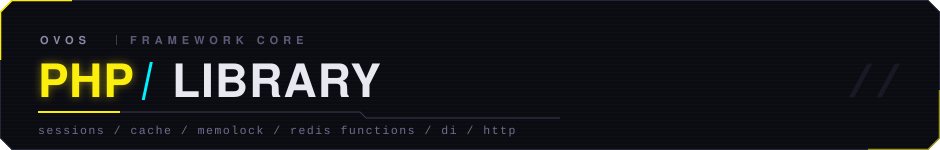
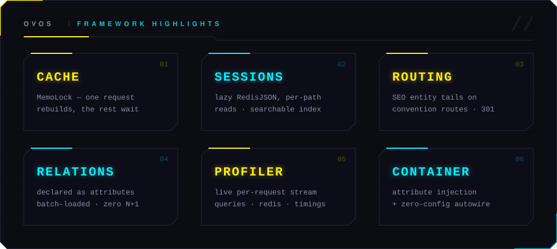
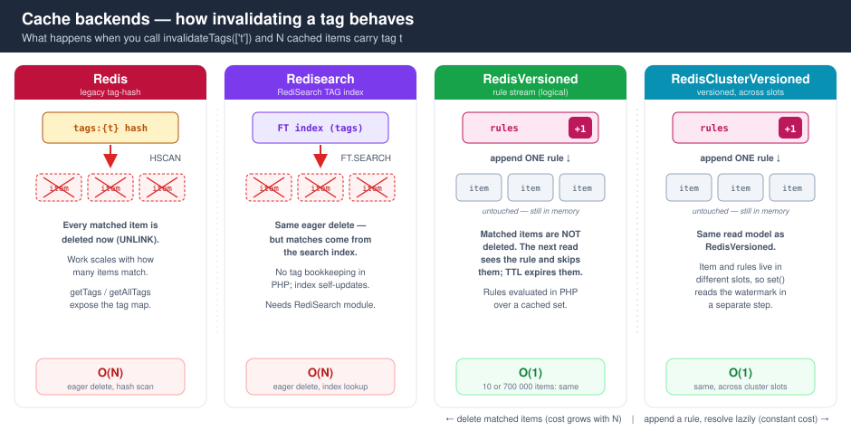
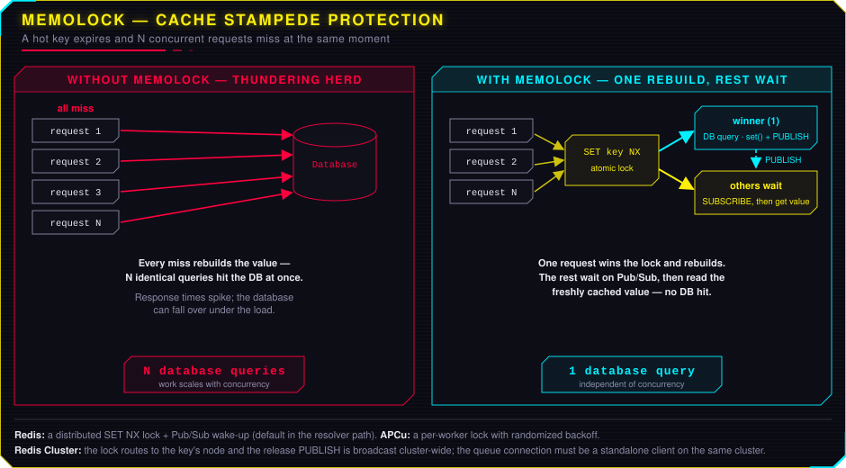

<p align="center">
	
</p>

# ovos php-library

A batteries-included MVC framework and infrastructure toolkit for modern PHP
(8.3+), built around one idea: **production concerns handled once, in one
place, instead of re-solved per project.** It has powered commercial web
applications for over a decade and is developed against real production
workloads.

<p align="center">
	
</p>

**GitHub:** https://github.com/ovos/php-library

## What makes it different

Most of this README is the expected core — routing, controllers, models with a
query builder, views, plugins, a self-wiring DI container, YAML config,
translations, migrations and CLI tooling. What you *won't* find off the shelf
is the infrastructure layer, built for production traffic:

### ⚡ A cache that never stampedes

When a hot key expires, **one** request rebuilds the value while every other
request waits on a Redis Pub/Sub signal — instead of a thundering herd hitting
the database. That's **MemoLock**, and it is on by default for any `get()` with
a resolver. Invalidation is tag-based; on the versioned stores a whole tag drops
in **O(1)**, no matter how many keys carry it.

```php
$user = $store->get("user:$id", fn() => $this->loadUser($id), ttl: 300, tags: ["user:$id"]);
$store->invalidateTags(["user:$id"]);   // O(1) on the versioned stores
```

Two tiers behind one interface: APCu per-worker memory and a shared
Redis / RediSearch / versioned store. → [Cache](#cache) ·
[README.CACHE.md](README.CACHE.md) · [README.MEMOLOCK.md](README.MEMOLOCK.md)

### 🧠 Sessions as lazy RedisJSON documents

Keep the classic native handler, or switch to a **lazy RedisJSON** handler that
reads and writes one path at a time — never the whole blob — with per-value
locking, a user-journey timeline, and a **searchable RediSearch index over live
sessions** (answer *"who is online with role = admin?"* with a query).
→ [Sessions](#sessions) · [README.SESSION.md](README.SESSION.md)

### 🔗 Routing derived from the filesystem — no route table

Controllers **are** the routes. `/api/v1/ingest` walks the `Api\V1\Ingest`
namespace; the next segment is the action; the rest become its arguments —
**typed** (`yes`→`true`, `42`→`int`) and **matched by name** (`company-id` →
`$companyId`). It's locale-aware and needs zero configuration — nothing to
register, nothing to keep in sync with the code.

SEO entity URLs layer on top of that: an action opts into a trailing
`{slug},{id}{suffix}` with `#[Route\Article]` — looked up by the **authoritative
id**, a drifted slug **301s** to canonical for free, the typed entity injected.

```php
class News extends Controller
{
    #[Route\Article(model: Article::class, slug: 'url_title')]
    public function article(Article $article): Response { /* entity bound */ }
}
```

→ [Custom resolvers (SEO URLs)](#custom-resolvers-seo-urls)

### 🎯 Relations declared as attributes, with zero N+1

Declare a relation once as an attribute — the single source of the fk column,
key, child store and query scope. `withRelations()` eager-loads with **one `IN`
query per relation**, never N+1. A declared-but-unloaded relation still
lazy-loads on access and leaves a **note in the profiler**, so an accidental
N+1 in a loop is visible, not silent.

```php
#[Relation\Many('Competences', JobCompetence::class, by: 'job_id', key: 'competence_id')]
#[Relation\One('Category', Category::class, on: 'category_id')]
class Job extends Model\Mysql {}

$jobs = $store->withRelations($jobs);   // one IN query per relation
```

→ [Relations](#relations)

### 📡 A profiler built into the request

Every request carries a live profiler: the SQL it ran, the Redis commands it
issued and where the time went — streamed as it happens. Uncaught errors report
to [ovos/console](https://github.com/ovos/console) out of the box, with the same
per-request timeline attached. → [Configuration](#configuration-environmentsyml)

### 🧩 A container that wires itself

Zero-config autowiring resolves unregistered types on the fly. Inject by type,
by container key (`#[Inject('auth')]`), or into properties *before* the
constructor runs; pull a nested config path straight into a parameter with
`#[ArrayObject]`. Singletons by default, `transient: true` for a fresh instance
each call, lazy proxies on PHP 8.4+. → [Dependency Injection](#dependency-injection-container)

### 🧱 More, shipped in the box

**Redis Functions** deployed *with* your code and self-healed via source-hash
markers (standalone and cluster) · **typed request bodies** with
`$this->input()` (forgiving, dot-path, never a blind cast) · a dependency-free
**UUIDv4** · a built-in **test & benchmark runner** · **forms** with
filters/validators/rendering · **gettext translations** with per-vendor
overrides.

## Companion modules

- https://github.com/ovos/php-module-system (system management: cache, sessions, migrations, tests, benchmarks)
- https://github.com/ovos/php-module-admin (administration panel)

## Requirements

* PHP 8.3 - 8.5
* MySQL 8.0 - 9.6
* Redis 8.0+ (standalone or Redis Cluster)
* Extensions: `apcu`, `yaml`, `redis`, `intl`, `mbstring`, `pdo`, `json`, `simplexml`, `openssl`, `curl`, `zend-opcache`

## Table of Contents

- [What makes it different](#what-makes-it-different)
- [Installation](#installation)
- [Project Structure](#project-structure)
- [Bootstrap & Entry Points](#bootstrap--entry-points)
- [Environment File (.env)](#environment-file-env)
- [Configuration (environments.yml)](#configuration-environmentsyml)
  - [Config Field Reference](#config-field-reference)
- [Modules](#modules)
- [Routing](#routing)
  - [Custom resolvers (SEO URLs)](#custom-resolvers-seo-urls)
- [Controllers](#controllers)
- [Models](#models)
  - [Relations](#relations)
- [Stores](#stores)
  - [Using the Find Trait](#using-the-find-trait)
  - [Query Builder](#query-builder)
- [Views](#views)
- [Plugins](#plugins)
- [Services](#services)
- [Dependency Injection (Container)](#dependency-injection-container)
  - [Registration Methods](#registration-methods)
  - [Lazy Registration (PHP 8.4+)](#lazy-registration-php-84)
  - [Transient Scope](#transient-scope)
  - [Constructor Injection](#constructor-injection)
  - [Attribute-Based Injection](#attribute-based-injection)
  - [Property Injection](#property-injection)
  - [Config Path Extraction](#config-path-extraction)
  - [Method Call Autowiring](#method-call-autowiring)
  - [Circular Dependency Detection](#circular-dependency-detection)
- [Translations](#translations)
- [Migrations](#migrations)
- [Cache](#cache)
- [Sessions](#sessions)
- [CLI Commands](#cli-commands)
- [Forms](#forms)
  - [Creating a Form Component](#creating-a-form-component)
  - [Elements](#elements)
  - [Filters](#filters)
  - [Validators](#validators)
  - [Using Forms in Controllers](#using-forms-in-controllers)
  - [Rendering Forms in Views](#rendering-forms-in-views)

---

## Installation

1. Add SSH config for private repositories:
```
Host ovos.php-library
    HostName github.com
    PreferredAuthentications publickey
    IdentityFile ~/.ssh/ovos.php-library
```

2. Create a new project directory and `composer.json`:
```json
{
  "name": "ovos/my-project",
  "type": "project",
  "repositories": [
    { "type": "git", "url": "git@github.com:ovos/php-library.git" },
    { "type": "git", "url": "git@github.com:ovos/php-module-system.git" },
    { "type": "git", "url": "git@github.com:ovos/php-module-admin.git" }
  ],
  "require": {
    "php": ">=8.3.0",
    "ext-apcu": "*",
    "ext-redis": "*",
    "ext-yaml": "*",
    "ext-intl": "*",
    "ext-pdo": "*",
    "ovos/php-library": "dev-release/8.5",
    "ovos/php-module-system": "dev-release/8.5"
  },
  "autoload": {
    "psr-4": {
      "Controllers\\": "application/controllers",
      "Models\\": "application/models",
      "Stores\\": "application/stores",
      "Plugins\\": "application/plugins",
      "Components\\": "application/components",
      "Widgets\\": "application/widgets",
      "MyApp\\": "libraries/MyApp"
    }
  }
}
```

3. Run:
```bash
composer install
cp .env.example .env
```

---

## Project Structure

A typical project using php-library follows this layout:

```
project/
├── .env                              # Environment variables (not committed)
├── .env.example                      # Template for .env
├── init.php                          # Bootstrap initialization
├── cli.php                           # CLI entry point
├── composer.json
├── application/
│   ├── configs/
│   │   └── environments.yml          # Main configuration file
│   ├── controllers/                  # HTTP & CLI controllers
│   │   ├── Index.php                 # Default controller
│   │   └── Admin/
│   │       └── Banner.php            # Nested controller → /admin/banner
│   ├── models/                       # Data models
│   │   └── User.php
│   ├── stores/                       # Data access layer (repositories)
│   │   └── Users.php
│   ├── plugins/                      # Controller plugins (middleware)
│   │   ├── Auth.php
│   │   └── Layout/
│   │       └── Page.php
│   ├── components/                   # Form components
│   │   └── Admin/
│   │       └── BannerForm.php
│   ├── widgets/                      # Reusable view widgets
│   ├── views/                        # View templates (.phtml)
│   │   ├── index/
│   │   │   └── index.phtml
│   │   └── layouts/
│   │       └── page.phtml
│   ├── translations/                 # .po/.mo translation files
│   │   ├── phrases.php               # Translation key registry
│   │   ├── de.po / de.mo
│   │   └── en.po / en.mo
│   ├── migrations/                   # Database migrations
│   │   └── 20210226000000_Struct.php
│   └── tests/                        # Test classes
├── libraries/
│   └── MyApp/                        # Project-specific library code
│       ├── Services.php              # Custom Services class
│       └── Service/
│           └── Auth.php              # Custom authentication service
├── public/                           # Web root (DocumentRoot)
│   └── index.php                     # HTTP entry point
└── vendor/
    └── ovos/
        ├── php-library/              # This framework
        └── php-module-system/        # System module (cache, migrations, tests)
```

---

## Bootstrap & Entry Points

### HTTP Entry Point (`public/index.php`)

Point your web server's DocumentRoot to the `public/` directory.

```php
<?php
namespace Ovos;

define('BASE_DIR', dirname(__DIR__) . DIRECTORY_SEPARATOR);
require_once BASE_DIR . 'init.php';

$app = new Application();
$app->run();
```

### CLI Entry Point (`cli.php`)

```php
<?php
namespace Ovos;

define('BASE_DIR', __DIR__ . DIRECTORY_SEPARATOR);
require_once BASE_DIR . 'init.php';

$app = new Application(Application::INT_CLI);
$app->run();
```

### Bootstrap Initialization (`init.php`)

```php
<?php
namespace Ovos;

if(date_default_timezone_get() === '')
{
    date_default_timezone_set('Europe/Vienna');
}

require_once BASE_DIR . 'vendor' . DIRECTORY_SEPARATOR . 'autoload.php';
```

<details>
<summary><b>Application lifecycle</b> — what the constructor does before <code>run()</code> (rarely needed)</summary>

The `Application` constructor runs these steps in order, then `$app->run()`
routes the request and dispatches to a controller:

1. **init()** - Register Application, Request, Router, Memory in container
2. **initEnvironment()** - Load `.env` and `environments.yml`
3. **initShutdownHandler()** - Register shutdown function for response sending
4. **initBootstrap()** - Select bootstrap config (multi-app support)
5. **initDomain()** - Match current domain from config
6. **initConstants()** - Define `SYSTEM_HOST`, `SYSTEM_PATH`, `LOGS_DIR`, etc.
7. **initProtocol()** - Enforce HTTPS/HTTP as configured
8. **initModules()** - Load modules (controllers, views, translations)
9. **initServices()** - Register and instantiate services

</details>

---

## Environment File (.env)

The `.env` file stores environment-specific secrets (database credentials, API keys) using INI format. It is loaded before the YAML config and its values are accessible via `!ENV` tags in the configuration.

### Example `.env.example`

```ini
ENV = development

[MYSQL]
HOST = localhost
DATABASE = my_project
USERNAME = root
PASSWORD = root

[REDIS]
HOST = 127.0.0.1
PORT = 6379
DATABASE = 0

[SESSION]
; a Redis DSN consumed as save_path by the native session handler
SAVE_PATH = "tcp://127.0.0.1:6379?database=0&timeout=2&prefix=MYAPP_SESSION:"

[CACHE]
PREFIX = myproject

[DATABASE_ENCRYPTION]
; bin2hex(random_bytes(16)) — used only when a model column opts into encryption
KEY = "change-me-32-hex-chars"

[SMTP]
HOST = 127.0.0.1
PORT = 2525
ENCRYPTION = ""
USERNAME = ""
PASSWORD = ""
```

**Key points:**
- The framework does **not** ship a root `.env.example` — the keys are
  project-specific. Add exactly the sections your `environments.yml` reads via
  `!ENV`, and nothing more; the block above is a common starting point.
- `ENV` determines which top-level key in `environments.yml` is used (e.g., `development`, `production`)
- Sections like `[MYSQL]` create grouped variables read in YAML as `!ENV MYSQL[HOST]`, `!ENV MYSQL[DATABASE]`, etc.
- Copy your project's `.env.example` to `.env` and adjust values for your local setup
- Never commit `.env` to version control

---

## Configuration (environments.yml)

The main configuration file lives at `application/configs/environments.yml`. It uses YAML format with YAML anchors (`&name`) and aliases (`*name`) for DRY inheritance between environments.

### A complete annotated example

Don't be put off by the length — this is the *whole* shape in one place, and a
`development` environment that simply inherits `production` with `<<:
*production` and overrides a handful of keys. In practice you copy a project's
`environments.yml` and change the `vendor`, domains, connections and cache
store. The [Config Field Reference](#config-field-reference) below lists what
each key does and what it defaults to.

```yaml
production: &production
  vendor: my-project
  system: &system
    path: /
    bootstraps:
      - path:
        controller:
          http: index
          cli: cli
    domain: www.my-project.com
    protocol: https
    debug: no

    # Locales
    locales:
      de:
        symbol: de_AT
        name: Deutsch
        language: de
        country: AT
        default: yes
      en:
        symbol: en_US
        name: English
        language: en
        country: US

    # Modules
    modules:
      application:
        path: application
        controllers: true
        translations: true
        views: true
        vendor: false
      system:
        path: vendor/ovos/php-module-system/application
        controllers: true
        translations: true
        views: true

    # Migrations
    migrations:
      - vendor/ovos/php-module-system/application/migrations
      - application/migrations

    # Tests & Benchmarks
    tests:
      - vendor/ovos/php-library/tests
      - application/tests
    benchmarks:
      - vendor/ovos/php-library/benchmarks

    # Services
    services:
      http:
        - Events
        - Logger
        - Benchmark
        - Session
        - Cookies
        - Cache
      cli:
        - Events
        - Logger
        - Benchmark
        - Cache

    # Plugins
    plugins:
      default:
        http:
          - Locales
          - Vendor
          - Layout\Page
          - Form
        cli:
          - Vendor
      groups: []

    # Profilers
    profilers: &profilers
      enabled: no
      queries:
        limit: 20
      append:
        http: no
        cli: yes
      helpers:
        - queries
        - console
        - benchmark

    # View helpers
    view_helpers:
      namespaces:
        - MyApp\View\Helper\

    # Collectors
    collectors:
      system:
        controller: System\Collector
        action: collect
        days: 180

  # Cookies
  cookies: &cookies
    prefix: myapp-
    samesite: Lax

  # Database connections
  connections: &connections
    mysql:
      type: mysql
      host: !ENV MYSQL[HOST]
      database: !ENV MYSQL[DATABASE]
      username: !ENV MYSQL[USERNAME]
      password: !ENV MYSQL[PASSWORD]
    redis:
      type: redis
      host: !ENV REDIS[HOST]
      port: !ENV REDIS[PORT]
      database: !ENV REDIS[DATABASE]
      connect_timeout: 1
      read_timeout: 1

  # Session
  session: &session
    cookie_name: session
    cache_limiter: private_no_expire, must-revalidate
    ini:
      save_handler: redis
      save_path: !ENV SESSION[SAVE_PATH]

  # Encryption
  encryption:
    method: AES-128-GCM
    key: YOUR_HEX_KEY_HERE  # bin2hex(random_bytes(16))

  # Database
  database: &database
    connection: mysql

  # Cache
  cache: &cache
    enabled: yes
    prefix: !ENV CACHE[PREFIX]
    perishable: &cache-perishable
      compression:
        enabled: yes
        threshold: 2048
      queue:
        enabled: yes
        lock_ttl_s: 1
        wait_timeout_s: 2
    persistent: &cache-persistent
      connection: redis
      store: Redisearch
      compression:
        enabled: yes
        threshold: 2048
      queue:
        enabled: yes
        connection: redis
        lock_ttl_ms: 2000
        wait_attempts: 3

  # CLI
  cli:
    executable: php

development: &development
  <<: *production
  system: &development-system
    <<: *system
    path: /my-project/
    domain: null
    domains:
      - localhost
    protocol: https
    debug: yes
    profilers:
      <<: *profilers
      enabled: yes

  database:
    <<: *database

  cache:
    <<: *cache
    persistent:
      <<: *cache-persistent
```

### Config Field Reference

| Field | Description |
|-------|-------------|
| `vendor` | Project identifier, used for vendor-specific translation paths |
| `system.path` | Base URL path (e.g., `/` for root, `/my-project/` for subfolder) |
| `system.bootstraps` | Array of app bootstraps. Each has a `path` and default `controller` for http/cli |
| `system.domain` | Single domain for the environment. Use `null` if using `domains` |
| `system.domains` | Array of accepted domains (for development with multiple hosts) |
| `system.port` | Custom port number (if not standard 80/443) |
| `system.protocol` | `https` or `http` - enforced with redirect |
| `system.debug` | `yes`/`no` - show exceptions and debug info |
| `system.locales` | Locale definitions keyed by URL name (e.g., `de`, `en`) |
| `system.locales.{name}.symbol` | Full locale symbol (e.g., `de_AT`, `en_US`) |
| `system.locales.{name}.default` | `yes` to mark as default locale |
| `system.locales.{name}.controllers` | Array of controllers where this locale is unlocked |
| `system.modules` | Module definitions (see [Modules](#modules)) |
| `system.services` | Service lists for `http` and `cli` interfaces |
| `system.services.container` | Custom Services class (e.g., `\MyApp\Services`) |
| `system.plugins` | Plugin configuration (see [Plugins](#plugins)) |
| `system.profilers` | Profiler/debug output settings |
| `system.view_helpers.namespaces` | Custom View helper namespaces (checked before `Ovos\View\Helper\`) |
| `system.migrations` | Array of paths to scan for migration files |
| `system.tests` | Array of paths to scan for test files |
| `system.benchmarks` | Array of paths to scan for benchmark files |
| `system.collectors` | Garbage collection / cleanup jobs config |
| `connections.mysql` | MySQL connection: `host`, `database`, `username`, `password` |
| `connections.redis` | Redis connection: `host`, `port`, `database`, timeouts |
| `connections.{name}.type: redis_cluster` | Redis Cluster connection: `seeds` (list of `host:port`), timeouts |
| `session` | Session config: `cookie_name`, `save_handler`, `save_path` |
| `cookies.prefix` | Cookie name prefix |
| `cookies.samesite` | SameSite attribute: `Lax`, `Strict`, or `None` |
| `database.connection` | Which connection to use for models/stores (default: `mysql`) |
| `database.encryption` | Database-level encryption config (`method`, `key`) |
| `encryption` | System-level encryption config (`method`, `key`) |
| `cache.enabled` | `yes`/`no` - master cache switch |
| `cache.prefix` | Cache key prefix (prevents collisions between projects) |
| `cache.perishable` | APCu (per-worker memory) cache config |
| `cache.persistent` | Redis (distributed) cache config |
| `cache.persistent.store` | `Redis`, `Redisearch`, `RedisVersioned` or `RedisClusterVersioned` backend |
| `http_auth` | HTTP Basic Auth: `enabled`, `username`, `password`, `realm`, `whitelist` |
| `smtp` | SMTP mail config: `host`, `port`, `encryption`, `username`, `password` |

### Accessing Config in Code

```php
// Global function
$config = config();

// Via application
$config = $this->app->getConfig();

// Access values
$debug = $config->system->debug;                    // Direct property access
$host = $config->connections->mysql->host;           // Nested access
$value = $config->getPath('system.cache.enabled');   // Dot-notation path
$value = $config->getPath(['system', 'cache']);       // Array path
```

---

## Modules

Modules are self-contained packages with controllers, views, translations, and more. They are registered in `environments.yml`:

```yaml
system:
  modules:
    application:              # Your project code
      path: application
      controllers: true       # Register controllers for routing
      translations: true      # Add translations path
      views: true             # Add views to include path
      vendor: false           # No vendor-specific translations subfolder
    system:                   # System module (from composer)
      path: vendor/ovos/php-module-system/application
      controllers: true
      translations: true
      views: true
```

Each module follows the same directory structure:
```
module/
├── controllers/       # Controller classes
├── models/            # Model classes
├── stores/            # Store classes
├── plugins/           # Plugin classes
├── views/             # .phtml templates
├── translations/      # .po/.mo translation files
├── migrations/        # Database migrations
└── widgets/           # Reusable widget components
```

**Module loading** happens during `initModules()`:
- If `controllers: true`, the module's controllers become routable
- If `translations: true`, the `translations/` directory is registered with the Translator
- If `views: true`, the `views/` directory is added to PHP's include path (view files are resolved by searching through all registered paths)

---

## Routing

URLs are automatically mapped to controllers and actions:

```
HTTP: /controller/action/param1/value1/param2/value2
CLI:  php cli.php controller action param1 value1
```

### URL Mapping Examples

| URL | Controller Class | Action Method | Params |
|-----|-----------------|---------------|--------|
| `/` | `Controllers\Index` | `index()` | - |
| `/user/login` | `Controllers\User` | `login()` | - |
| `/admin/banner` | `Controllers\Admin\Banner` | `index()` | - |
| `/select/job/id/42` | `Controllers\Select` | `job(int $id)` | `id=42` |

**How it works:**
- The Router scans all module `controllers/` directories for available controllers
- Controller names use StudlyCase (file `Admin/Banner.php` = class `Controllers\Admin\Banner`)
- The default action is `index` if no action segment is present
- Remaining URL segments become named parameters (`/key/value` pairs)
- Action method parameters are auto-filled from URL parameters by name

### Automatic Type Casting

All URL and CLI parameters arrive as strings. The framework automatically casts them
to match the type declarations on your action method using PHP reflection:

```php
// GET /select/job/id/42/rating/3.5
public function job(int $id, float $rating): Response
{
    // $id is automatically cast to int (42), $rating to float (3.5)
}
```

**Supported type casts:**

| Declared type | Cast | Example |
|---------------|------|---------|
| `int`, `?int` | `(int)` | `"42"` → `42` |
| `float`, `?float` | `(float)` | `"3.5"` → `3.5` |

Additionally, the Router converts these string literals **before** they reach the action method:

| String value | Converted to |
|--------------|-------------|
| `"true"`, `"yes"` | `true` |
| `"false"`, `"no"` | `false` |
| `"null"` | `null` |

This applies to both HTTP and CLI parameters:

```
HTTP: /events/list/active/yes/page/2
CLI:  php cli.php events list active yes page 2
```

```php
public function list(bool $active, int $page): Response
{
    // $active = true (from "yes"), $page = 2 (from "2")
}
```

Parameters are matched by name using camelCase conversion, so a URL parameter
`company-id` matches a method parameter `$companyId`.

### Custom resolvers (SEO URLs)

The convention router above is the **default**. Before it runs, an ordered
chain of resolvers gets first say - each either claims the URL or declines so
the next (ultimately the convention router) can try. Unconfigured, nothing
changes; add resolver class names to `system.routes.resolvers`:

```yaml
system:
  routes:
    resolvers:
      - App\Route\MyResolver
```

A `Resolver` is one method:

```php
interface Resolver
{
    public function resolve(Url $url, Request $request): ?Resolution;
}
```

#### `#[Route\Article]` — SEO entity tails

For the common case — a human-readable URL that ends in an entity reference —
you don't need a full resolver. Controller and action come from the convention
router (locale-aware); the action just declares which model a trailing
`{slug},{id}{suffix}` binds to:

```php
class News extends Controller
{
    #[Route\Article(
        model: Article::class,   // model the tail binds to
        slug: 'url_title',       // the column holding the slug (canonical)
        id: 'id',                // the authoritative lookup column (default)
        suffix: '.html',         // trailing literal (default)
        separator: ',',          // between slug and id (default)
    )]
    public function article(Article $article): Response { /* entity bound */ }
}
```

For `/news/article/leistung-ist-das-fundament,101600.html` (or
`/de/news/article/…` — locale is preserved):

- **the id is authoritative** - the entity is looked up by `id` (indexed), the
  slug is decorative;
- **canonical enforcement** - a drifted slug **301s** to the canonical URL (only
  the tail segment is rewritten, so locale/controller/action are preserved), and
  it's free since the row was fetched anyway;
- **route-model binding** - the loaded entity replaces the raw tail param and is
  passed to the action, typed. A tail whose id resolves to no row is a **404**.

The `,{id}{suffix}` tail is a shape the convention router never emits, so it
never collides with a normal route. This augments convention rather than
replacing it — for URLs that don't map to a model at all, write a `Resolver`.

---

## Controllers

Controllers handle HTTP requests and CLI commands. They extend `Ovos\Controller`.

### HTTP Controller Example

```php
<?php
declare(strict_types=1);

namespace Controllers;

use Ovos\Controller;
use Ovos\Response;
use Ovos\View;
use Stores\Users as UsersStore;

class Users extends Controller
{
    /**
     * GET /users → index action (default)
     */
    public function index(): Response
    {
        $view = new View('users/index.phtml');

        $store = new UsersStore;
        $view->users = $store->getAll();

        return new Response\Html($view->render());
    }

    /**
     * GET /users/edit/id/42 → edit action with named parameter
     */
    public function edit(int $id): Response
    {
        $view = new View('users/edit.phtml');

        $store = new UsersStore;
        $view->user = $store->find(['id' => $id]);

        return new Response\Html($view->render());
    }

    /**
     * JSON response example
     */
    public function data(): Response
    {
        $response = new Response\Json;
        $response->data = ['items' => [1, 2, 3]];
        return $response;
    }

    /**
     * POST handling example
     */
    public function save(): Response
    {
        $response = new Response\Json;

        if($this->request->isPost())
        {
            $post = $this->request->getPost();
            // process form data...
            $response->success = true;
        }

        return $response;
    }

    /**
     * Redirect example
     */
    public function old(): Response
    {
        return (new Response\Redirect('users'))
            ->withQueryString();
    }
}
```

### CLI Controller Example

```php
<?php
declare(strict_types=1);

namespace Controllers;

use Ovos\Controller;
use Ovos\Functions;

// Usage: php cli.php import run
class Import extends Controller\Cli
{
    use Controller\Traits\Cli;

    public function run(): void
    {
        $this->log('Starting import...');

        // Do work...

        $this->log('Import complete: %d items processed', $count);
    }
}
```

### Registering Custom Plugins in a Controller

```php
class Index extends Controller
{
    public function registerPlugins(): void
    {
        // Conditionally add plugins
        if($this->request->getActionMethod() === 'index')
        {
            $this->addPlugin(new Layout\Homepage);
        }
        else
        {
            $this->addPlugin(new Layout\Page);
        }
    }
}
```

### Available Properties in Controllers

| Property | Description |
|----------|-------------|
| `$this->app` | Application instance |
| `$this->request` | Current Request object |
| `$this->container` | DI Container |
| `$this->params` | URL parameters |

### Available Methods

| Method | Description |
|--------|-------------|
| `$this->request->isPost()` | Check if POST request |
| `$this->request->getPost()` | Get POST data |
| `$this->request->getLocale()` | Get current Locale |
| `$this->_('phrase')` | Translate a phrase (via Translatable trait) |
| `$this->_n('one', 'many', $n)` | Translate plural |
| `$this->addPlugin($plugin)` | Register a plugin |
| `$this->setDispatched(true)` | Stop further dispatching (e.g., after redirect) |

---

## Models

Models represent database records. They extend `Ovos\Model\Mysql`.

### Creating a Model

```php
<?php
declare(strict_types=1);

namespace Models;

use Ovos\Model\Mysql;
use Ovos\Model\Mysql\Template\Timestamps;
use Ovos\Pdo\Expression;
use Override;
use Stores\Users;

/**
 * Use @property annotations for IDE autocompletion
 *
 * @property int $id
 * @property string $username
 * @property string $email
 * @property string $role
 * @property int $active
 * @property mixed $created_at
 * @property mixed $modified_at
 */
class User extends Mysql
{
    // Constants for roles, statuses, etc.
    public const string ROLE_ADMIN = 'admin';
    public const string ROLE_USER = 'user';

    // Which properties to expose (e.g. for JSON serialization)
    public const array PROPERTIES_PERSISTABLE = [
        'id', 'username', 'email', 'role',
    ];

    /**
     * Link to the corresponding Store class
     */
    #[Override]
    public static function getStoreClass(): string
    {
        return Users::class;
    }

    /**
     * Set up templates and setters
     */
    #[Override]
    public function setUp(): void
    {
        // Automatically manages created_at and modified_at columns
        $this->addTemplate(new Timestamps);
    }

    // Custom business logic methods
    public function isAdmin(): bool
    {
        return $this->role === self::ROLE_ADMIN;
    }

    public function softDelete(): static
    {
        $this->deleted_at = new Expression('NOW()');
        $this->save();
        return $this;
    }
}
```

### Model Operations

```php
// Create a new record
$user = new User;
$user->username = 'john';
$user->email = 'john@example.com';
$user->role = User::ROLE_USER;
$user->insert();          // INSERT into database, auto-increment ID is set

// Update an existing record
$update = new User;
$update->email = 'new@example.com';
$user->update($update);   // UPDATE only the modified fields

// Save (insert or update depending on existence)
$user->email = 'changed@example.com';
$user->save();

// Delete
$user->delete();

// Check if record was fetched from database
$user->exists();           // true if fetched with primary key

// Array conversion
$array = $user->toArray();
$user->fromArray(['email' => 'test@example.com']);

// JSON serialization (respects PROPERTIES_PERSISTABLE if defined)
json_encode($user);
```

### Relations

Declare a model's relations ONCE with attributes - the single source of the
fk column, reference name, key column, child store and query scope that used
to live smeared across hand-written `referenceByX()` store methods:

```php
#[Relation\Many('Competences', JobCompetence::class,
	by: 'job_id', key: 'competence_id',
	store: JobsCompetences::class, scope: 'activeCompetences')]
#[Relation\One('Category', Category::class, on: 'category_id')]
class Job extends Model\Mysql
```

- `Many(name, model, by, key, ?store, ?scope, lazy)` - children carry the
  parent's id in `by` and land on the parent's reference keyed by `key`.
- `One(name, model, on, ?store, ?scope, key = 'id', lazy)` - the parent's
  `on` column points at the child's `key`; the child model is assigned.
- `store` defaults to the child model's own (`Model::getStoreClass()`).
- Attributes cannot carry closures, so query shaping is a NAMED SCOPE on the
  child store: `scope: 'activeCompetences'` calls
  `$store->scopeActiveCompetences($query)`.

**Batched eager loading** - one `IN` query per relation, never N+1; every
parent ends up with the reference SET (empty array / null when nothing
matched), so a loaded-empty reference is distinguishable from a never-loaded
one:

```php
$jobs = $store->withRelations($jobs);                       // every declared relation
$jobs = $store->withRelations($jobs, ['Competences']);      // selected
$jobs = $store->withRelations($jobs, ['Competences'], [     // per-call overrides
	'Competences' => fn($query) => $query->andWhere('level > 2'),
]);

$jobs[7]->Competences;      // keyed by competence_id
$jobs[7]->Category?->name;
```

**Lazy fallback** - reading a declared, never-loaded relation fetches it for
that one model and leaves a dev-console note (visible in the profiler panel):
a lazy load inside a loop is exactly the N+1 the batched path prevents. Mark
hot-path relations `lazy: false` to keep them from ever auto-fetching -
unloaded access then returns null, silently.

---

## Stores

Stores are the data access layer (repositories). They extend `Ovos\Store\Mysql` and provide query building and fetching.

### Creating a Store

```php
<?php
declare(strict_types=1);

namespace Stores;

use Models\User;
use Ovos\Store\Mysql;
use Ovos\Store\Mysql\Traits\Find;
use PDO;

class Users extends Mysql
{
    use Find;  // Adds find() and findAll() helper methods

    public const ?string TABLE = 'users';

    public const ?string MODEL = User::class;

    /**
     * Custom query: find user by email
     */
    public function findByEmail(string $email): false|User
    {
        $query = $this->query()
            ->select()
            ->where('email = ?');

        $statement = $this->prepareQuery($query);
        $statement->execute([$email]);

        return $statement->fetchObject(User::class);
    }

    /**
     * Custom query: get all active users
     */
    public function getActive(): array
    {
        $query = $this->query()
            ->select()
            ->where('active = 1')
            ->orderBy('username', 'ASC');

        $statement = $this->prepareQuery($query);
        $statement->execute();

        return $this->fetchAll($statement, User::class);
    }

    /**
     * Custom query with COUNT
     */
    public function countActive(): int
    {
        $query = $this->query()
            ->select('COUNT(id)')
            ->where('active = 1');

        $statement = $this->prepareQuery($query);
        $statement->execute();

        return (int)$statement->fetchColumn();
    }

    /**
     * Execute a DELETE/UPDATE and return affected row count
     */
    public function deleteOlderThan(int $days): int
    {
        $query = $this->query()
            ->delete('created_at <= NOW() - INTERVAL ' . $days . ' DAY');

        return $this->executeQuery($query);
    }
}
```

### Using the Find Trait

The `Find` trait adds `find()` — a convenience wrapper around `executeFind()` that automatically
fetches results as model instances.

```php
$store = new Users;

// Find a single record — returns User|false
$user = $store->find(where: ['id' => 42]);

// Find multiple records — returns User[]
$users = $store->find(where: ['active' => 1], many: true);
```

`find()` accepts the same named parameters as `executeFind()`, plus `many`:

| Parameter | Type | Description |
|-----------|------|-------------|
| `where` | `array` | `['column' => value]` — AND equality conditions |
| `select` | `string` | Column list (default `'*'`) |
| `orWhere` | `array` | `['column' => value]` — OR equality conditions |
| `whereIn` | `array` | `['column' => [values]]` — IN clause |
| `whereNotIn` | `array` | `['column' => [values]]` — NOT IN clause |
| `isNull` | `array` | `['column', ...]` — IS NULL conditions |
| `isNotNull` | `array` | `['column', ...]` — IS NOT NULL conditions |
| `like` | `array` | `['column' => pattern]` — LIKE conditions |
| `notLike` | `array` | `['column' => pattern]` — NOT LIKE conditions |
| `query` | `?callable` | Callback receiving the `Select` query builder for structural options |
| `many` | `bool` | `false` = single model, `true` = array of models (Find trait only) |

#### Query callback

The `query` callback receives the `Select` query builder object, giving access to ordering,
limits, joins, grouping, and any other structural query options:

```php
// Order and limit
$users = $store->find(
    where: ['active' => 1],
    query: fn($q) => $q->orderBy('created_at DESC')->limit(10),
    many: true,
);

// Group by with aggregate
$statement = $store->executeFind(
    select: 'role, COUNT(*) as total',
    query: fn($q) => $q->groupBy('role')->orderBy('total DESC'),
);

// Left join
$users = $store->find(
    select: 'users.*, orders.total',
    query: fn($q) => $q
        ->leftJoin('orders ON orders.user_id = users.id')
        ->orderBy('users.id ASC'),
    many: true,
);

// Combine value conditions with structural options
$users = $store->find(
    where: ['active' => 1],
    whereIn: ['role' => ['admin', 'editor']],
    notLike: ['email' => '%example.com'],
    query: fn($q) => $q->orderBy('username ASC')->limit(20)->offset(40),
    many: true,
);
```

### Query Builder

The query builder provides a fluent interface:

```php
$query = $this->query()
    ->select('id, username, email')           // SELECT columns
    ->from('users')                            // FROM table (optional, uses TABLE const)
    ->join('orders', 'orders.user_id = users.id')  // JOIN
    ->where('active = ?')                      // WHERE
    ->andWhere('role = ?')                     // AND WHERE
    ->orWhere('email LIKE ?')                  // OR WHERE
    ->groupBy('role')                          // GROUP BY
    ->orderBy('created_at', 'DESC')            // ORDER BY
    ->limit(10)                                // LIMIT
    ->offset(20);                              // OFFSET

$statement = $this->prepareQuery($query);
$statement->execute([$active, $role, $emailPattern]);
```

### Store Usage in Controllers

```php
// Direct instantiation
$store = new UsersStore;
$user = $store->findByEmail('john@example.com');

// Via Container (for dependency injection)
$store = $this->container->getClass(UsersStore::class);
```

### JSON API controllers

Extend `Ovos\Controller\Api` for JSON endpoints. It provides the request-body
reader and the standard `Response\Json` envelopes, so actions carry no
plumbing (a fresh `Response\Json` is already a success — list/ok responses
need no helper):

| Helper | HTTP | Meaning |
|--------|------|---------|
| `badRequest($msg)` | 400 | malformed request (silent) |
| `notFound($msg)` | 404 | resource does not exist |
| `unprocessable($errors)` | 422 | understood but failed validation (`field => message`) |
| `unavailable($msg)` | 503 | a dependency is down (silent) |
| `serverError($err)` | 500 | unexpected error (logged) |

#### Typed request body — `$this->input()`

`$this->input()` returns an `Ovos\Http\Input`: a **typed, forgiving** reader
over the decoded JSON body, so actions stop hand-writing defensive casts. A
missing or malformed body yields an empty `Input`, and every getter returns
the typed value or the default — never a warning. Dot-paths reach nested
values.

```php
public function index(): Response
{
    $response = new Response\Json;
    $body = $this->input(Body::MEDIUM);   // size tier; empty on missing/malformed

    $result = $this->grid()->query(
        $body->array('filters'),          // [] unless a real array
        $body->string('search'),          // '' unless a string
        $body->string('sort.field', 'ts'),// nested, with a default
        $body->int('page', 1),            // only clean integers; never (int)"12abc"
        $body->int('limit', 50),
    );
    $response->rows = $result['rows'];

    return $response;
}
```

| Getter | Returns |
|--------|---------|
| `string($path, $default='')` | a scalar as string, else default |
| `trimmed($path, $default='')` | trimmed string, default if empty after trim |
| `int($path, $default=0)` | a real int or clean integer string (never a blind cast) |
| `float($path, $default=0.0)` | a numeric value |
| `bool($path, $default=false)` | framework semantics — `true`/`"true"`/`"yes"`/`1` |
| `array($path, $default=[])` | any array |
| `list($path, $default=[])` | a sequential list (a map does not qualify) |
| `ids($max=100)` | capped **positive int** ids from `{id}` or `{ids:[…]}` |
| `email($path)` | one validated email, or `null` |
| `emails($path)` | a validated email list, or `null` if **any** entry is invalid |
| `has($path)` / `get($path,$d)` / `all()` / `isEmpty()` | existence / raw / whole body / emptiness |

For a bulk action:

```php
$body = $this->input(Body::BULK);
$affected = $this->repository()->setChecked($body->ids(), $body->bool('checked', true));
```

The size tiers on `Http\Body` (`TINY` 4K, `SMALL` 16K, `MEDIUM` 64K, `BULK`
256K) cap the accepted body so callers name a tier instead of a magic byte
count. `Body::json()` (raw `?array`) and `Body::input()` are also available
statically for controllers not extending `Api`.

---

## Views

Views are `.phtml` template files that mix PHP and HTML. They extend `Ovos\View`.

### Rendering a View in a Controller

```php
public function index(): Response
{
    $view = new View('users/index.phtml');

    // Assign variables to the view
    $view->users = $store->getAll();
    $view->title = 'User List';

    return new Response\Html($view->render());
}
```

### View Template Example (`views/users/index.phtml`)

```php
<?php
/** @var \Ovos\View $this */
?>

<h1><?= $this->_('Users') ?></h1>

<ul>
<?php foreach($this->users as $user): ?>
    <li>
        <a href="<?= $this->url('users', 'edit', ['id' => $user->id]) ?>">
            <?= $this->escape($user->username) ?>
        </a>
    </li>
<?php endforeach ?>
</ul>
```

### Available Variables in Views

| Variable | Description |
|----------|-------------|
| `$this->app` | Application instance |
| `$this->config` | Configuration (ArrayObject) |
| `$this->request` | Current Request |
| `$this->url` | Current URL string |
| `$this->controller` | Current controller name |
| `$this->action` | Current action name |
| `$this->locale` | Current Locale object |
| `$this->interface` | Interface type (`http` or `cli`) |

### Partials

Render a sub-template with its own variable scope:

```php
<?= $this->partial('users/partials/row.phtml', ['user' => $user]) ?>
```

### View Helpers

View helpers are static utility classes accessed via method calls. Built-in helpers include:

```php
// In a .phtml template:

// Page title
<?php $this->title()->set('My Page Title') ?>

// Placeholders (content blocks)
<?php $this->placeholders()->header->append('<link rel="stylesheet" href="custom.css">') ?>

// URL generation
<?= $this->url('users', 'edit', ['id' => $user->id]) ?>

// Asset management
<?= $this->asset()->css('styles/main.css') ?>
<?= $this->asset()->js('scripts/app.js') ?>

// Messages (flash messages)
<?php $this->messages()->success('Saved successfully!') ?>
```

### Custom View Helpers

Register custom namespaces in config:

```yaml
system:
  view_helpers:
    namespaces:
      - MyApp\View\Helper\
```

Then create your helper class:

```php
<?php
namespace MyApp\View\Helper;

class MyHelper
{
    public function format(string $value): string
    {
        return strtoupper($value);
    }
}
```

Usage in views: `<?= $this->myHelper()->format('hello') ?>`

---

## Plugins

Plugins are controller middleware that run before and/or after every action dispatch. They extend `Ovos\Controller\Plugin`.

### Creating a Plugin

```php
<?php
declare(strict_types=1);

namespace Plugins;

use Ovos\Container\Inject;
use Ovos\Controller\Plugin;
use Ovos\Response;
use Override;

class Auth extends Plugin
{
    public const string SYMBOL = 'auth';

    public function __construct(
        #[Inject('auth')] ?MyAuthService $authService,
    )
    {
        parent::__construct();
        $this->authService = $authService;
    }

    /**
     * Runs BEFORE the controller action
     */
    #[Override]
    public function preDispatch(): void
    {
        if($this->authService->isAuthenticated())
        {
            return;
        }

        // Redirect to login
        $response = new Response\Redirect('user/login');
        $this->getController()->setDispatched(true);
    }

    /**
     * Runs AFTER the controller action
     */
    #[Override]
    public function postDispatch(): void
    {
        // Post-processing logic
    }
}
```

### Layout Plugin Example

Layout plugins wrap the controller's response in a layout template:

```php
<?php
declare(strict_types=1);

namespace Plugins\Layout;

use Ovos\Plugins\Layout;
use Override;
use Widgets\Menu;

class Page extends Layout
{
    protected array $placeholders = ['bodyEnd'];

    public function __construct(string $layout = 'page.phtml')
    {
        parent::__construct($layout);
    }

    #[Override]
    public function preDispatch(): void
    {
        // Build navigation menu
        $menu = new Menu('widgets/footer-menu.phtml');
        $menu->add(new Menu\Item($this->_('Contact'), 'contact'));
        $menu->add(new Menu\Item($this->_('Privacy'), 'privacy'));

        $this->getLayout()->placeholders()
            ->footer->append($menu->__toString());
    }
}
```

### Configuring Plugins

Plugins are registered in `environments.yml`:

```yaml
system:
  plugins:
    # Default plugins applied to ALL controllers
    default:
      http:                    # For HTTP requests
        - Locales              # Locale management
        - Vendor               # Vendor-specific translations
        - Auth                 # Authentication check
        - Layout\Page          # Page layout wrapper
        - Form                 # Form processing support
      cli:                     # For CLI commands
        - Vendor

    # Per-controller overrides
    groups:
      # Skip Auth for public controllers
      - controllers:
          - Index
          - Welcome
        http:
          skip:
            - Auth

      # Skip ALL plugins for system controllers
      - controllers:
          - System
        http:
          skip:
            - "*"
        cli:
          skip:
            - "*"

      # Replace layout for admin controllers
      - controllers:
          - Admin
        http:
          skip:
            - Layout\Page
          add:
            - Layout\Admin
            - Admin\Access
```

### Accessing Plugins from a Controller

```php
// Get plugin by symbol (defined in the plugin's SYMBOL constant)
$this->auth()->disable();
$this->auth()->authorizeAction('login');

// Disable layout
$this->layout()->disable();
```

---

## Services

Services are globally available objects registered in the container. They extend `Ovos\Service`.

### Built-in Services

| Service | Description |
|---------|-------------|
| `Events` | Error and exception handling |
| `Logger` | File-based error logging |
| `Benchmark` | Request performance measurement |
| `Session` | PHP session management (Redis-backed) |
| `Cookies` | HTTP cookie handling |
| `Cache` | Cache management (APCu + Redis) |
| `Memory` | APCu memory cache for configs/translations |

### Registering Services

Services are listed in `environments.yml`:

```yaml
system:
  services:
    container: \MyApp\Services   # Optional: custom Services class
    http:                         # Services for HTTP requests
      - Events
      - Logger
      - Session
      - Cookies
      - Cache
      - \MyApp\Service\Auth      # Custom service (fully qualified class name)
    cli:                          # Services for CLI commands
      - Events
      - Logger
      - Cache
```

### Custom Services Class

Override the Services class to add typed property access:

```php
<?php
declare(strict_types=1);

namespace MyApp;

use Ovos\Services as ParentServices;
use MyApp\Service\Auth;

use function Ovos\container;

/**
 * @property Auth $auth
 */
class Services extends ParentServices
{
}

function services(): Services
{
    return container()->get(ParentServices::class);
}
```

### Creating a Custom Service

```php
<?php
declare(strict_types=1);

namespace MyApp\Service;

use Ovos\Container\Inject;
use Ovos\Service;
use Ovos\Service\Session;
use Ovos\Service\Cookies;

class Auth extends Service
{
    public const string SYMBOL = 'auth';

    public function __construct(
        #[Inject(Session::SYMBOL)] protected Session $session,
        #[Inject(Cookies::SYMBOL)] protected Cookies $cookies,
    )
    {
    }

    public function hasUser(): bool
    {
        return $this->session->offsetExists('user_id');
    }
}
```

### Accessing Services

```php
// Via services() helper
$auth = services()->auth;

// Via container in controllers
$cache = $this->container->get(Cache::SYMBOL);
$session = $this->container->get(Session::SYMBOL);

// Via container anywhere
$auth = container()->get('auth');
```

---

## Dependency Injection (Container)

The framework uses a singleton DI container accessible via `container()`.
Dependencies are resolved automatically by type, with zero-config auto-registration —
unregistered types are resolved on the fly without manual wiring.

### Registration Methods

```php
use function Ovos\container;

$c = container();

// Register a class (instantiated on first get())
$c->registerClass('my_service', MyService::class, ['param1' => 'value']);

// Register and immediately get an instance
$instance = $c->getClass(MyService::class);

// Register a factory callable
$c->registerCallable('mailer', function(Container $c) {
    return new Mailer($c->get('config')->smtp);
});

// Register an existing object instance
$c->registerObject('config', $configObject);

// Register a raw value
$c->registerValue('app_name', 'My Application');
```

All resolved dependencies are **singletons by default** — `get()` returns the same instance.
See [Transient Scope](#transient-scope) for creating fresh instances on every call.

### Lazy Registration (PHP 8.4+)

On PHP 8.4+, `registerLazy()` creates a [lazy proxy](https://www.php.net/manual/en/language.oop5.lazy-objects.php)
that defers instantiation until the object is actually accessed. On older PHP versions, it falls back to `registerClass()`.

```php
// The class is not instantiated until a property or method is accessed
$c->registerLazy(HeavyService::class);

$service = $c->get(HeavyService::class); // Returns a lightweight proxy
$service->doWork();                       // Now the real object is created
```

### Transient Scope

By default, every resolved dependency is a singleton (cached after first creation).
Use `transient: true` to get a **fresh instance on every `get()` call**:

```php
// Every get() creates a new instance
$c->registerClass(FormBuilder::class, transient: true);

$a = $c->get(FormBuilder::class);
$b = $c->get(FormBuilder::class);
// $a !== $b

// Also works with callables
$c->registerCallable(RequestLogger::class,
    fn() => new RequestLogger(microtime(true)),
    transient: true,
);
```

Transient is available on `registerClass()` and `registerCallable()` — the two registration
types where creating new instances makes sense. `registerObject()` and `registerValue()` are
inherently singletons (pre-built instances), and `registerLazy()` defers creation rather than
repeating it.

### Constructor Injection

When a class is resolved from the container, its constructor parameters are automatically injected:

```php
class UserController extends Controller
{
    public function __construct(
        private UsersStore $store,          // Auto-resolved from container by type
        private Cache $cache,               // Auto-resolved from container by type
    )
    {
        parent::__construct();
    }
}
```

### Attribute-Based Injection

Use the `#[Inject]` attribute to inject dependencies by container key:

```php
use Ovos\Container\Inject;

class Auth extends Plugin
{
    public function __construct(
        #[Inject('auth')] ?AuthService $authService,    // By container key
        #[Inject(Session::SYMBOL)] Session $session,     // By service symbol
    )
    {
        parent::__construct();
    }
}
```

### Property Injection

Properties can also be injected using the `#[Inject]` attribute:

```php
class MyService extends Service
{
    #[Inject]
    protected Container $container;     // Auto-injected by type

    #[Inject]
    protected Application $app;         // Auto-injected by type

    #[Inject]
    protected Request $request;         // Auto-injected by type
}
```

Properties marked with `#[Inject]` are resolved **before** the constructor is called,
so constructor code can use injected properties.

### Config Path Extraction

The `#[ArrayObject]` attribute works as a post-processor on injected values,
extracting nested paths from configuration objects:

```php
use Ovos\Container\Inject;
use Ovos\Container\ArrayObject as InjectArrayObject;

class Benchmark extends Service
{
    // Injects config->system->profilers as an ArrayObject
    #[Inject('config')]
    #[InjectArrayObject('system', 'profilers')]
    protected ?ArrayObject $profilers = null;
}
```

This also works on constructor parameters:

```php
class MyService
{
    public function __construct(
        #[Inject('config')]
        #[InjectArrayObject('system', 'database', 'credentials')]
        private ArrayObject $credentials,
    )
    {
    }
}
```

### Method Call Autowiring

The `call()` method resolves a method's parameters from the container and invokes it —
using the same resolution chain as constructor injection (by name, `#[Inject]` key, or type):

```php
class ReportGenerator
{
    public function generate(
        UsersStore $users,                  // Auto-resolved from container
        string $format,                     // Matched by name from $values
    ): Report
    {
        // ...
    }
}

$generator = new ReportGenerator;
$report = $container->call($generator, 'generate', [
    'format' => 'pdf',
]);
```

Method parameters support the full attribute chain, including `#[Inject]` and `#[ArrayObject]`:

```php
public function configure(
    #[Inject('config')]
    #[InjectArrayObject('system', 'profilers')]
    ArrayObject $profilers,
): void
{
    // ...
}

$container->call($service, 'configure');
```

### Circular Dependency Detection

The container detects circular dependencies and throws an exception with the full chain:

```php
// If A depends on B and B depends on A:
$c->registerClass(A::class);
$c->registerClass(B::class);
$c->get(A::class);
// throws: "Circular dependency detected: A -> B -> A."
```

### Using the Container in Controllers

Controllers have full access to the container via `$this->container`:

```php
class Dashboard extends Controller
{
    public function index(): Response
    {
        // Get a service by its symbol
        $cache = $this->container->get(Cache::SYMBOL);

        // Get or create an instance of a class
        $store = $this->container->getClass(UsersStore::class);

        // Get the config
        $config = $this->container->get('config');

        // Get custom registered service
        $mailer = $this->container->get('mailer');

        // ...
    }
}
```

### What's Registered by Default

The Application automatically registers these in the container:

| Key / Type | Object |
|------------|--------|
| `Application::class` | The Application singleton |
| `Request::class` | The current Request |
| `Router::class` | The Router |
| `Container::class` | The Container itself |
| `Environment::class` | The Environment |
| `'config'` | The configuration ArrayObject |
| `Services::class` | The Services manager |
| All service symbols | Each registered Service (e.g., `'cache'`, `'session'`, `'events'`) |

---

## Translations

The framework supports multi-language translation using GNU gettext `.mo` files and the `Translatable` trait.

### Setup

1. Define locales in `environments.yml`:

```yaml
system:
  locales:
    de:
      symbol: de_AT
      name: Deutsch
      language: de
      country: AT
      default: yes
    en:
      symbol: en_US
      name: English
      language: en
      country: US
```

2. Create a `phrases.php` registry in `application/translations/`:

```php
<?php
// Register all translatable phrases for extraction tools
_('Welcome');
_('Login');
_('Save & close');

// Plural forms
_n('One item', '{0} items', 0);
```

3. Create `.po` files for each language (e.g., `en.po`, `de.po`):

```po
msgid "Welcome"
msgstr "Willkommen"

msgid "Login"
msgstr "Anmelden"

# Parameterized translations use MessageFormatter syntax
msgid "Showing {0} to {1} out of {2}"
msgstr "Zeige {0} bis {1} von {2}"
```

4. Use [Poedit](https://poedit.net/) to edit `.po` files. Poedit can scan your application's source code directly to discover new translatable phrases and detect changes, and compiles `.mo` files automatically on save.

### Using Translations

In **controllers** (via `Translatable` trait):
```php
$message = $this->_('Welcome');
$message = $this->_n('One item', '{0} items', $count);
```

In **views** (via `Translatable` trait):
```php
<h1><?= $this->_('Welcome') ?></h1>
<p><?= $this->_('Showing {0} to {1} out of {2}', $from, $to, $total) ?></p>
```

In **plugins** (via `Translatable` trait):
```php
$label = $this->_('Contact');
```

### Vendor-Specific Translations

When `vendor` is set in config and a module has `vendor: true`, the system also looks for translations in:
```
application/translations/{vendor}/de.mo
```

This allows the same module to have different translations per project.

---

## Migrations

Database migrations track schema changes. They extend `Ovos\Migration`.

### Creating a Migration

Create a file in `application/migrations/` with timestamp naming:

```
application/migrations/20250101000000_CreateProducts.php
```

```php
<?php
declare(strict_types=1);

namespace Migrations;

use Ovos\Migration;

class CreateProducts extends Migration
{
    public function up(): void
    {
        $this->upSql();
    }

    public function down(): void
    {
        $this->downSql();
    }
}
```

Create the corresponding SQL files alongside the PHP file:

**`20250101000000_CreateProducts.up.sql`:**
```sql
CREATE TABLE products (
    id INT UNSIGNED AUTO_INCREMENT PRIMARY KEY,
    name VARCHAR(255) NOT NULL,
    price DECIMAL(10,2) NOT NULL,
    created_at DATETIME DEFAULT CURRENT_TIMESTAMP,
    modified_at DATETIME DEFAULT NULL ON UPDATE CURRENT_TIMESTAMP
) ENGINE=InnoDB DEFAULT CHARSET=utf8mb4;
```

**`20250101000000_CreateProducts.down.sql`:**
```sql
DROP TABLE IF EXISTS products;
```

### Organizing Migrations

You can organize migrations into subdirectories:
```
application/migrations/
├── Initial/
│   ├── 20210226000000_Struct.php
│   └── 20210226000000_Struct.up.sql
├── Updates_2024/
│   └── 20240101000000_AddUserRoles.php
└── Updates_2025/
    └── 20250101000000_CreateProducts.php
```

Register migration paths in config:
```yaml
system:
  migrations:
    - vendor/ovos/php-module-system/application/migrations
    - application/migrations
```

### Running Migrations

```bash
php cli.php migrations status              # Show migration status
php cli.php migrations run                  # Run all pending migrations
php cli.php migrations run 1               # Run next 1 migration
php cli.php migrations rollback             # Rollback last migration
php cli.php migrations rollback 3           # Rollback last 3 migrations
```

---

## Cache

The framework provides a two-tier cache system. For full details, see the dedicated guides:

- **[README.CACHE.md](README.CACHE.md)** - Cache stores, usage patterns, invalidation, and configuration
- **[README.MEMOLOCK.md](README.MEMOLOCK.md)** - Cache stampede protection (MemoLock)

**Two tiers:**

- **Perishable (APCu)**: Fast, per-worker memory cache. Lost on restart.
- **Persistent (Redis/Redisearch/RedisVersioned/RedisClusterVersioned)**: Shared
  distributed cache with tag-based invalidation. The versioned stores
  invalidate tags in O(1) regardless of the match count, and `RedisClusterVersioned`
  runs the same model on a Redis Cluster.

How `invalidateTags()` differs across the persistent stores - the tag-hash and
RediSearch stores delete matched items eagerly (cost grows with matches), while
the versioned stores append one rule and resolve staleness lazily (constant cost):



See [README.CACHE.md](README.CACHE.md) for the per-store read/write/invalidate flows.

### Using Cache in Code

```php
$cacheService = $this->container->get(Cache::SYMBOL);

// Get the persistent store (Redis)
$store = $cacheService->getPersistent()->getStore();

// Get with resolver (recommended - handles cache misses)
$value = $store->get(
    'user:42',
    resolver: fn() => $this->fetchUserFromDB(42),
    ttl: 300,                    // 5 minutes
    tags: ['user', 'user:42'],   // For tag-based invalidation
);

// Invalidate by tag
$store->invalidateTags(['user:42']);

// Perishable cache (APCu)
$perishable = $cacheService->getPerishable()->getStore();
$value = $perishable->get('key', resolver: fn() => 'computed', ttl: 60);
```

### MemoLock (Cache Stampede Protection)

When many requests hit an expired cache key simultaneously, MemoLock ensures only one request computes the value while others wait. **MemoLock is enabled by default** - if you use `get()` with a resolver, you're already protected.



```php
$value = $store->get(
    'expensive_key',
    resolver: fn() => $this->expensiveComputation(),
    ttl: 60,
    queue: true,              // Enable queueing (default)
    queueLockTtlMs: 2000,    // Lock timeout
);
```

See [README.MEMOLOCK.md](README.MEMOLOCK.md) for advanced usage: manual lock control, lock renewal, error handling, and standalone mutex usage.

---

## Sessions

The `Session` service supports two storage handlers (`session.handler` config): the native PHP machinery (`php`, default) and a lazy RedisJSON handler (`json`) with per-path reads/writes, per-value MemoLock locking, a user journey timeline, and active-session counting.

- **[README.SESSION.md](README.SESSION.md)** - Lazy RedisJSON session storage: configuration, the path API, locking, journey, migration notes

---

## CLI Commands

Commands provided by `php-module-system`:

```bash
# Cache management
php cli.php system cache clear              # Clear all cache
php cli.php system cache collect-garbage    # Force garbage collection

# Database migrations
php cli.php migrations status               # Show status
php cli.php migrations run                   # Run pending migrations
php cli.php migrations rollback              # Rollback last migration

# Tests
php cli.php tests run                        # Run all tests
php cli.php tests run MyTest                 # Run specific test class
php cli.php tests run MyTest myMethod        # Run specific test method

# Benchmarks
php cli.php benchmarks run                   # Run all benchmarks

# System
php cli.php system stats free-space          # Show disk space
php cli.php system collector                 # Run garbage collectors
php cli.php system sessions clear            # Clear sessions
php cli.php system sessions gc               # Collect session garbage (json handler
                                             # activity index; cron-friendly)
php cli.php system tools encrypt "text"      # Encrypt a string
php cli.php system tools decrypt "cipher"    # Decrypt a string
```

### Colored Output

`Terminal` writes ANSI color when — and only when — something is there to render
it. `Terminal::supportsColor()` decides once per process:

| Condition | Result |
|---|---|
| `NO_COLOR` set to any non-empty value | off ([no-color.org](https://no-color.org)) |
| `CLI_COLOR=1` / `=0` (`true`/`yes`/`on`, `false`/`no`/`off`) | forced on / off |
| `STDOUT` is a terminal | on (Windows: VT processing is switched on first) |
| running inside a composer script (`COMPOSER_BINARY` set) with a usable `TERM` | on |
| anything else — cron, `>> log.txt`, systemd, CI | off |

The composer rule exists because composer relays script output through its own IO
layer: `STDOUT` is a pipe, so `stream_isatty()` says "no terminal" for the exact
case — `composer prod:update` — where the colored profiler tables are wanted.
Composer passes escape sequences through untouched (and does **not** propagate
its own `--no-ansi` to scripts), so the decision belongs to the shell that
launched composer, with `TERM` standing in for it. Cron carries no `TERM`, which
keeps escapes out of a redirected log.

Nothing needs to opt in. `Terminal::output($message, markup: true)` declares that
a string carries `<color>` markup; whether it resolves to ANSI or gets stripped
is the environment's call, so a caller cannot force escapes into a log file.
`Response\Cli::disableColoredOutput()` silences color for one response — output
meant to be read by a program — and `CLI_COLOR=1` or
`Terminal::setSupportsColor()` is how you force it ON, process-wide. There is
deliberately no per-response force: it could only ever reach part of the output,
since a `Table` renders what it is handed while every log line goes through
`getMessage()`.

> **Upgrading:** `setColoredOutput(bool)` was removed rather than quietly
> repurposed — its `true` branch had become a no-op once detection landed. Replace
> `setColoredOutput(false)` with `disableColoredOutput()`, and drop
> `setColoredOutput(true)` entirely: the environment already decides. A CLI action
> that carried a `bool $coloredOutput` parameter for this no longer needs one.

`Terminal\Table` renders markup when told to (`hasMarkup()`), measuring column
widths on the *visible* text so colored cells still line up. **Hand it markup,
not ANSI**: it strips control bytes out of cell content, so a pre-resolved
`"\033[1;32m…"` renders as literal text where `<green>…<reset>` renders as color.

`Terminal\Highlighter` supplies the profiler tables' colors — SQL keywords and
literals, redis commands and keys, and time/memory thresholded per table, since
"slow" for one query is not "slow" for a whole request. It sanitizes its input
first, via `Formatter::stripControls()`: color is the only terminal feature this
library speaks, and it always arrives as `<color>` markup, so a value carrying
control bytes loses them — the ESC goes and what followed stays as inert, visible
text. That is what stops a bound value from painting a fake red `ERROR` into a
table, renaming your terminal window, or writing your clipboard via OSC 52.

---

## Forms

The framework includes a form component system for building, validating, filtering, and rendering HTML forms. Forms are defined as PHP classes, used in controllers, and rendered in views via a helper.

### Creating a Form Component

Create form classes in `application/components/`. Each form extends `Ovos\Form` and configures its elements in the `init()` method:

```php
<?php
declare(strict_types=1);

namespace Components\User;

use Ovos\Form;
use Ovos\Form\Filter;
use Ovos\Form\Validator;

/**
 * @property Form\Element $username
 * @property Form\Element $password
 * @property Form\Element $remember
 * @property Form\Element $not_human
 */
class LoginForm extends Form
{
    public function init(): void
    {
        $this->username
            ->setLabel($this->_('E-mail'))
            ->addFilter(new Filter\Trim)
            ->addValidator(new Validator\NotEmpty)
            ->addValidator(new Validator\EmailAddress);

        $this->password
            ->setLabel($this->_('Password'))
            ->addFilter(new Filter\Trim)
            ->addValidator(new Validator\NotEmpty);

        $this->remember
            ->addFilter(new Filter\Checked);

        $this->not_human
            ->addValidator(new Validator\NotHuman);
    }
}
```

**Key conventions:**

- Extend `Ovos\Form` and override `init()` for element configuration
- Use `@property` docblocks for IDE autocompletion on dynamic elements
- Elements are created automatically when accessed via `$this->elementName` (magic `__get`)
- All setters return `$this` for fluent method chaining
- Use `$this->_('...')` for translatable labels and messages (via the `Translatable` trait)

**Assigning typed elements explicitly:**

For `Options` or `File` elements, assign them explicitly rather than relying on auto-creation:

```php
use Ovos\Form\Element\Options;
use Ovos\Form\Element\Options\Option;

public function init(): void
{
    $this->gender = (new Options)
        ->addOptions([
            new Option('male', $this->_('male')),
            new Option('female', $this->_('female')),
            new Option('misc', $this->_('diverse')),
        ])
        ->addValidator(new Validator\NotEmpty);
}
```

**Constructor injection for dependencies:**

When a form needs external data, accept it via constructor:

```php
class CompaniesForm extends Form
{
    public function __construct(
        protected readonly array $selectedJobs,
        ?string $id = null,
    )
    {
        parent::__construct($id);
    }

    public function init(): void
    {
        $this->setId('companies');

        $this->jobs = (new Options)
            ->fromObjects($this->selectedJobs, 'id', 'name');
        $this->jobs->setValue(array_column($this->selectedJobs, 'id'));
    }
}
```

**Form inheritance:**

Forms can extend other forms to reuse field definitions:

```php
class SearchForm extends Form
{
    public function init(): void
    {
        $this->query = (new Element)
            ->addValidator(new NotEmpty);
    }
}

// Extended form adds fields
class ExtendedSearchForm extends SearchForm
{
    public function init(): void
    {
        parent::init();
        $this->setId('search-form');

        $this->limit = (new Element)
            ->addFilter(new Integer);
        $this->limit->setDefault(10);
    }
}
```

### Elements

#### Element (default)

The base `Ovos\Form\Element` is created automatically when you access any property on a form. Suitable for text inputs, passwords, hidden fields, and checkboxes.

```php
$form->username->setLabel('Username');
$form->username->setValue('john');
$form->username->setDefault('guest');

// Value retrieval (after filters are applied)
$form->username->getValue();       // Filtered value (with default fallback)
$form->username->getInputValue();  // Filtered value with default
$form->username->getUserValue();   // Filtered value without default (null if no input)
```

#### Options

`Ovos\Form\Element\Options` is used for select dropdowns, radio buttons, and checkbox groups. The rendered type depends on the view helper configuration.

```php
use Ovos\Form\Element\Options;
use Ovos\Form\Element\Options\Option;

// From key-value array
$this->country = (new Options)
    ->addOptions([
        'AT' => 'Austria',
        'DE' => 'Germany',
    ]);

// From Option objects (when you need specific values and labels)
$this->gender = (new Options)
    ->addOptions([
        new Option('male', $this->_('male')),
        new Option('female', $this->_('female')),
    ]);

// From database objects
$this->jobs = (new Options)
    ->fromObjects($jobs, 'id', 'name');

// Access options
foreach ($this->jobs->getOptions() as $option) {
    $option->getValue();      // The value attribute
    $option->getLabel();      // The display label
    $option->isSelected();    // Whether currently selected
    $option->getObject();     // Original object (when using fromObjects)
}
```

Options automatically validates that submitted values exist in the available options.

#### File

`Ovos\Form\Element\File` handles file uploads with MIME type validation. It automatically adds a `FileUploaded` validator.

```php
use Ovos\Form\Element\File;

$this->avatar = (new File([
    'jpg' => 'image/jpeg',
    'png' => 'image/png',
]))->setLabel($this->_('Avatar'));

// After validation, access file properties
$file->name;      // Original filename
$file->tmp_name;  // Temporary path
$file->size;      // File size in bytes
$file->type;      // MIME type (set by validator)
$file->ext;       // Extension (set by validator)
```

### Filters

Filters transform values before validation. They are applied in the order they are added.

```php
$this->username
    ->addFilter(new Filter\Trim)
    ->addFilter(new Filter\StripTags)
    ->addFilter(new Filter\NullIfEmpty);
```

| Filter | Description | Example |
|--------|-------------|---------|
| `Trim($mask?)` | Trim whitespace (or custom characters) | `new Trim()`, `new Trim('.,')` |
| `LeftTrim($mask?)` | Trim from left only | `new LeftTrim('0')` |
| `StripTags($allowed?)` | Remove HTML tags | `new StripTags(['<b>', '<i>'])` |
| `Integer` | Cast to int | `'42'` → `42` |
| `FloatingPoint` | Cast to float | `'3.14'` → `3.14` |
| `Checked` | Checkbox to boolean int | `'on'` → `1`, `''` → `0` |
| `NullIfEmpty` | Empty to null | `''` → `null` |
| `Prefix($prefix)` | Add prefix if not present | `new Prefix('+43')` |
| `StripPrefix($prefix)` | Remove prefix | `new StripPrefix('https://')` |
| `Replace($pattern, $replacement)` | Regex replacement | `new Replace('/[^0-9]/', '')` |
| `Shorten($length, $ending)` | Truncate string | `new Shorten(100, '...')` |
| `Callback($fn)` | Custom filter function | `new Callback(fn($v) => strtolower($v))` |

### Validators

Validators check values after filters have been applied. A form element can have multiple validators, all of which must pass. Validators that fail produce `Ovos\Form\Error` objects.

```php
$this->email
    ->addValidator(new Validator\NotEmpty)
    ->addValidator(new Validator\EmailAddress);
```

| Validator | Description | Error Code |
|-----------|-------------|------------|
| `NotEmpty` | Value must not be empty | `empty` |
| `EmailAddress` | Valid email (allows empty — combine with `NotEmpty` if required) | `email_invalid` |
| `PasswordStrength($length, $uppercase, $digits, $special)` | Password complexity rules | `password_weak` |
| `SameAs($elementId)` | Must match another field's value | `different` |
| `IfChecked($elementId)` | Conditional: validates dependency between checkboxes | `not_checked` |
| `NotHuman` | Honeypot: valid only if empty (bot protection) | `not_human` |
| `FileUploaded` | Validates file upload (auto-added by `File` element) | various |
| `Callback($fn)` | Custom validation logic | `callback` |

**Custom error messages:**

```php
$validator = new Validator\NotEmpty;
$validator->setMessage(
    Validator\NotEmpty::ERROR_EMPTY,
    'This field is required!'
);
$this->field->addValidator($validator);
```

**Custom validator with element access:**

Callback closures are bound to the validator instance, giving access to the element and the full form:

```php
$this->birthdate->addValidator(
    (new Validator\Callback(function (mixed $value) {
        if ($value === null) return true;
        return $value >= 1901 && $value <= idate('Y');
    }))->setMessage(
        Validator\Callback::ERROR_CALLBACK,
        $this->_('The year of birth must be between 1901 and {0}', idate('Y'))
    )
);
```

### Using Forms in Controllers

The standard controller workflow: create the form, populate with POST data, validate, and process or display errors.

#### Basic workflow

```php
use Components\User\LoginForm;
use Ovos\Response;
use Ovos\View;

public function login(): Response
{
    $form = new LoginForm;
    $view = new View('user/login.phtml');
    $view->form = $form;

    if ($this->request->isPost())
    {
        $form->setValues($this->request->getPost());

        if ($form->isValid() === false)
        {
            $this->form()->handleErrors($form);
        }
        else
        {
            // Process valid data
            $username = $form->username->getValue();
            $password = $form->password->getValue();

            // ... authenticate, save, etc.
            return new Response\Redirect('dashboard');
        }
    }

    return new Response\Html($view->render());
}
```

#### Error handling

The `Form` plugin (registered in `environments.yml` as a default plugin) provides `handleErrors()` which iterates over all form errors and adds them as flash messages via `View::messages()`:

```php
// Standard — all errors displayed as flash messages
$this->form()->handleErrors($form);

// Skip specific error codes (to handle them manually)
$this->form()->handleErrors($form, [Validator\NotEmpty::ERROR_EMPTY]);

// Manual error handling
foreach ($form->getErrors() as $error)
{
    $error->getMessage();    // Error message string
    $error->getCode();       // Error code constant
    $error->getElement();    // The Element that failed
    $error->getValidator();  // The Validator that produced the error
}
```

#### Populating forms with existing data

```php
// From a model/array
$form->setValues([
    'first_name' => $user->first_name,
    'email' => $user->email,
]);

// Set defaults (used when no user input is provided)
$form->setDefaults(['role' => 'user']);

// Populate Options from database objects
$form->interests
    ->fromObjects($interests, 'id', 'name')
    ->setValue($selectedInterestIds);
```

#### Resetting form state

When handling checkboxes via AJAX, unchecked checkboxes are not sent in POST data. Call `reset()` before `setValues()` to clear cached values:

```php
$form->reset();
$form->setValues($this->request->getPost());
```

#### Accessing values

```php
// Single field
$form->username->getValue();        // Filtered value
$form->username->getUserValue();    // Filtered, no default fallback
$form->username->getInputValue();   // Filtered, with default fallback

// All fields
$form->getValues();        // All filtered values
$form->getUserValues();    // All filtered, no defaults
$form->getInputValues();   // All filtered, with defaults

// Save model from form
$values = $form->getValues();
$model->fromArray($values);
$model->save();
```

### Rendering Forms in Views

Forms are rendered in `.phtml` views using the `formElement()` view helper. The helper accepts an element and returns a chainable configuration object.

#### Basic rendering

```php
<form method="post" class="form" action="<?= $this->url('user', 'login') ?>" autocomplete="off">

    <?= $this->formElement($form->username)
        ->setType('email')
        ->setPlaceholder($form->username->getLabel())
    ?>

    <?= $this->formElement($form->password)
        ->setType('password')
        ->setPlaceholder($form->password->getLabel())
    ?>

    <?= $this->formElement($form->remember->setLabel($this->_('Keep me logged in')))
        ->setType('checkbox')
    ?>

    <button type="submit" class="button max">
        <?= $this->_('Sign in') ?>
    </button>

</form>
```

#### Supported types

The `setType()` value determines which template is rendered:

| Type | Element Class | Template | Description |
|------|--------------|----------|-------------|
| `text`, `email`, `password`, `search`, `number` | `Element` | `element-input.phtml` | Standard input fields |
| `checkbox` | `Element` | `element-checkbox.phtml` | Single checkbox with hidden "off" input |
| `file` | `File` | `element-file.phtml` | File upload input |
| (default) | `Options` | `options-select.phtml` | Select dropdown |
| `radio` | `Options` | `options-radio.phtml` | Radio button group |
| `checkbox` | `Options` | `options-checkbox.phtml` | Checkbox group |

The template is automatically selected based on the element type (`Element` vs `Options`) combined with `setType()`.

#### Helper configuration methods

| Method | Description |
|--------|-------------|
| `setType($type)` | Input type (`text`, `email`, `password`, `checkbox`, `radio`, `file`, `search`) |
| `setPlaceholder($text)` | Placeholder text |
| `setDescription($text)` | Description text shown below the label |
| `setElementClass($class)` | CSS class on the wrapper `div.form-element` |
| `setFieldClass($class)` | CSS class on the inner `div.form-field` |
| `setLabelClass($class)` | CSS class on the label element |
| `setLabelInsert($placeholder)` | Extra content next to the label (e.g., "Forgot password?" link) |
| `setInputInsert($placeholder)` | Extra content inside the input wrapper (e.g., password toggle button) |
| `setFieldInsert($placeholder)` | Extra content after the input (e.g., password strength indicator) |
| `setAttribute($name, $value)` | HTML attribute on the wrapper element |
| `setInputAttribute($name, $value)` | HTML attribute on the input element |
| `setOptionLabelCallback($fn)` | Custom label rendering for each option |
| `setOptionClassCallback($fn)` | Custom CSS class per option |
| `setOptionAttributesCallback($fn)` | Custom HTML attributes per option |

#### Using inserts for custom content

Inserts allow injecting additional HTML into specific positions within a form element. Use `Ovos\View\Placeholder` to capture content blocks:

```php
<?php use Ovos\View\Placeholder; ?>

<?php ($labelInsert = new Placeholder)->captureStart(); ?>
    <a href="<?= $this->url('user/password-reset') ?>">
        <?= $this->_('Password forgotten?') ?>
    </a>
<?php $labelInsert->captureEnd(); ?>

<?php ($inputInsert = new Placeholder)->captureStart(); ?>
    <button type="button" class="form-password-toggle icon-eye"
        title="<?= $this->_('Toggle password visibility') ?>"></button>
<?php $inputInsert->captureEnd(); ?>

<?= $this->formElement($form->password)
    ->setType('password')
    ->setPlaceholder($form->password->getLabel())
    ->setLabelInsert($labelInsert)
    ->setInputInsert($inputInsert)
?>
```

#### Rendering Options as checkbox or radio groups

```php
<?= $this->formElement($form->interests)
    ->setType('checkbox')
    ->setElementClass('select scrollable')
    ->setFieldClass('selectable')
?>

<?= $this->formElement($form->gender)
    ->setType('radio')
?>
```

#### CSS class structure

The form element templates generate a consistent CSS structure:

```
div.form-element.form-element-type-{type}.form-element-{id}[.errors]
├── div.form-element-label
│   ├── label.form-label[.error]
│   └── {labelInsert}
├── div.form-element-description
├── div.form-element-errors.messages
│   └── div.form-element-error.message.message-error (per error)
│       ├── div.message-icon.icon-exclamation-circle
│       └── div.message-body > p
└── div.form-field
    ├── div.form-input
    │   ├── input.form-control / select.form-control
    │   └── {inputInsert}
    └── {fieldInsert}
```

Errors are displayed inline within each form element. Elements with errors receive the `.errors` class on the wrapper and `.error` on the label, enabling CSS-based error styling.

#### Auto-save forms

For forms that submit automatically on change (e.g., via AJAX), add the `save-on-change` class and handle submission with JavaScript:

```php
<form method="post" class="form save-on-change"
    action="<?= $this->url('children', 'change-name', $child->id) ?>"
    autocomplete="off">
    <?= $this->formElement($form->name)
        ->setPlaceholder($this->_('Name'))
    ?>
</form>
```

---

## Useful Information

### Useful Redis Commands

```bash
docker exec -it redis-cache sh -c "redis-cli MONITOR"
docker exec -it redis-cache sh -c "redis-cli SLOWLOG GET 10"
docker exec -it redis-cache sh -c "redis-cli --latency"
docker exec -it redis-cache sh -c "redis-cli CONFIG GET timeout"
docker exec -it redis-cache sh -c "redis-cli CONFIG SET maxmemory-policy noeviction"
```

### Composer Scripts

Add these to your `composer.json` for convenience:

```json
{
  "scripts": {
    "cache:clear": "@php cli.php system cache clear",
    "migrations:run": "@php cli.php migrations run",
    "migrations:rollback": "@php cli.php migrations rollback",
    "test": "@php cli.php tests run",
    "prod:update": [
      "@composer install --no-dev --classmap-authoritative",
      "@migrations:run",
      "@cache:clear"
    ]
  }
}
```
